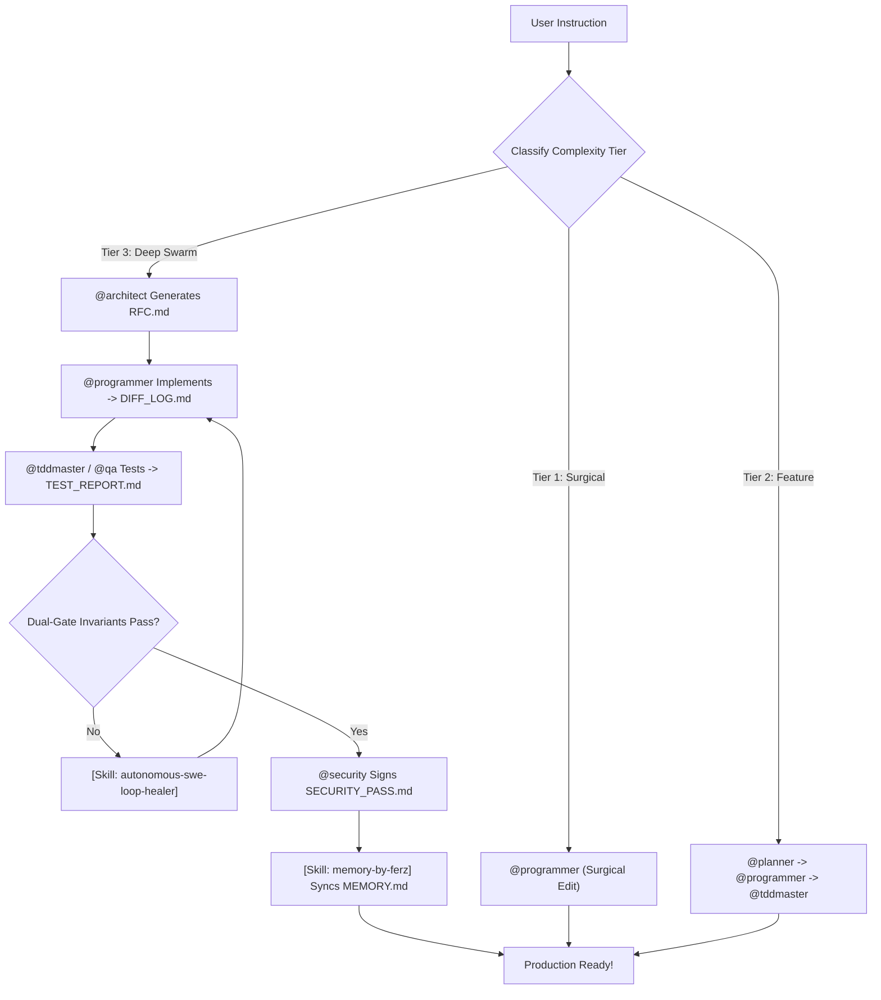

<div align="center">

# ⚡ FREEBUFF-POWER (Titanium Swarm Edition v4.0)
### The World's Most Advanced 42-Agent Autonomous Swarm, Dual-Gate QA Engine & Anti-Ban Shield for Freebuff

[](https://opensource.org/licenses/MIT)
[](#-specialized-sub-agents-roster-42-elite-agents)
[](#-modular-skills-catalog-1025-skills)
[](#-dual-gate-quality-invariants)
[](#-enterprise-anti-ban--anti-suspend-shield)
[](#-quick-installation-1-line-installer)

```
  ______ _____  ______ ______ ____  _    _ ______ ______   _____   ______          ________ _____  
 |  ____|  __ \|  ____|  ____|  _ \| |  | |  ____|  ____| |  __ \ / __ \ \        / /  ____|  __ \ 
 | |__  | |__) | |__  | |__  | |_) | |  | | |__  | |__    | |__) | |  | \ \  /\  / /| |__  | |__) |
 |  __| |  _  /|  __| |  __| |  _ <| |  | |  __| |  __|   |  ___/| |  | |\ \/  \/ / |  __| |  _  / 
 | |    | | \ \| |____| |____| |_) | |__| | |    | |      | |    | |__| | \  /\  /  | |____| | \ \ 
 |_|    |_|  \_\______|______|____/ \____/|_|    |_|      |_|     \____/   \/  \/   |______|_|  \_\
```

**Freebuff-Power v4.0** transforms Freebuff into an autonomous **42-Agent Titanium Swarm** powered by **1,025 Modular Skills**, Dual-Gate Quality Invariants, a 3-Tier Cognitive Execution Matrix, and enterprise-grade anti-ban safety.

[Instalasi 1 Baris](#-quick-installation-1-line-installer) • [Fitur Utama](#-fitur-utama-v40) • [Dual-Gate Invariants](#-dual-gate-quality-invariants) • [Roster 42 Sub-Agents](#-specialized-sub-agents-roster-42-elite-agents) • [Katalog Skills](#-modular-skills-catalog-1025-skills)

</div>

---

## ⚡ Quick Installation (1-Line Universal Installer)

Cukup salin dan jalankan **satu baris perintah** ini di terminal Linux atau macOS kamu:

```bash
curl -fsSL https://raw.githubusercontent.com/FerzDevZ/freebuff-power/main/install.sh | bash
```

*(Atau jika menggunakan Wget)*:
```bash
wget -qO- https://raw.githubusercontent.com/FerzDevZ/freebuff-power/main/install.sh | bash
```

---

## 🌟 Fitur Utama (v4.0 Titanium Swarm)

- 👥 **42 Specialized Sub-Agents**: Persona rekayasa terlengkap dari `@architect`, `@programmer`, `@monorepo-architect`, `@system-debugger-forensics`, `@tokenomics-fintech-ledger`, `@smart-contract-auditor`, `@nlp-rag-specialist`, hingga `@localization-i18n-pro`.
- 🛡️ **Dual-Gate Quality Invariants**: Kode wajib lolos 2 gerbang mutlak (Gerbang 1: Static Quality 0 linter error & zero AI-slop; Gerbang 2: Behavioral Invariants 1 happy-path test + 2 negative edge cases).
- 🧠 **Adaptive Cognitive Depth (3-Tier Matrix)**: Klasifikasi cerdas antara *Tier 1: Surgical Edits*, *Tier 2: Feature Development*, dan *Tier 3: Deep Swarm Architecture* dengan pembuatan dokumen `RFC.md` formal.
- 🔄 **Standardized Swarm Handoff Protocol**: Kolaborasi multi-agent terstruktur menggunakan artifact handoff (`RFC.md` $\rightarrow$ `DIFF_LOG.md` $\rightarrow$ `TEST_REPORT.md` $\rightarrow$ `SECURITY_PASS.md` $\rightarrow$ `MEMORY.md`).
- 🧰 **1,025 Modular Engineering Skills**: Pustaka komprehensif mencakup Next.js 15, FastAPI, Go concurrency, Rust Axum, PostgreSQL internals, Web3, 3D WebGL, hingga OWASP AppSec.
- 🛡️ **Enterprise Anti-Ban & Anti-Suspend Shield**: Isolasi telemetry UUID dinamis (`anon_<uuid_v4>`), reset residual lockfiles, dan proteksi context budget (Zero 413 error).
- 🪄 **Power Composer 2.0**: Analisis intent semantik dan auto-launch Freebuff langsung via `freebuff-power compose "<task>" --run`.

---

## 🛡️ Dual-Gate Quality Invariants

```
┌─────────────────────────────────────────────────────────────────────────┐
│                      DUAL-GATE QUALITY PASS/FAIL                        │
├────────────────────────────────────┬────────────────────────────────────┤
│  GATE 1: STATIC QUALITY            │  GATE 2: BEHAVIORAL VERIFICATION   │
├────────────────────────────────────┼────────────────────────────────────┤
│ • Zero Compiler / Linter Errors    │ • 1x Automated Happy-Path Test     │
│ • Zero TypeScript 'any' Coercions  │ • 2x Negative Edge-Case Tests      │
│ • Zero Synthetic Stubs (// TODO)   │ • Zero-Regression Self-Heal Loop   │
│ • Hallucination Circuit-Breaker    │ • Persistent MEMORY.md Auto-Sync   │
└────────────────────────────────────┴────────────────────────────────────┘
```

---

## 👥 Specialized Sub-Agents Roster (42 Elite Agents)

| Sub-Agent | Focus & Responsibility |
|---|---|
| `@architect` | System topology, technical RFCs, component boundaries & schema design |
| `@programmer` | Ultimate precision engineer, strict typing, Hallmark craftsmanship, zero AI slop |
| `@monorepo-architect` | Turborepo, Nx, PNPM workspaces, boundary enforcement, shared build caches |
| `@system-debugger-forensics` | Low-level memory leaks, CPU flamegraphs, race conditions, eBPF tracing |
| `@tokenomics-fintech-ledger` | Double-entry bookkeeping, ACID transactions, immutable financial ledgers |
| `@localization-i18n-pro` | Global internationalization (i18n), RTL CSS logical properties, ICU catalogs |
| `@smart-contract-auditor` | Web3, Solidity, EVM security, reentrancy guards, Foundry invariants |
| `@nlp-rag-specialist` | Advanced RAG, hybrid search (BM25 + Dense vector), semantic chunking |
| `@game-dev-3d` | 3D interactive graphics, Three.js, WebGL, custom GLSL shaders, Rapier physics |
| `@data-engineer-olap` | Real-time analytics, ClickHouse OLAP, DuckDB embedded queries, Parquet |
| `@cloud-security-architect` | Cloud IAM least-privilege, Zero-Trust networking, KMS encryption |
| `@microservices-mesh` | Distributed systems, Istio service mesh, gRPC, Kafka streams, Outbox pattern |
| `@accessibility-champion` | WCAG 2.2 AAA accessibility, keyboard traps, screen reader live regions |
| `@pwa-offline-architect` | Progressive Web Apps, Workbox service workers, IndexedDB, background sync |
| `@prompt-red-teamer` | AI security testing, adversarial prompt injections, NeMo guardrails |
| `@backend` | High-throughput backend APIs, microservices, auth, DB transactions |
| `@frontend` | Modern reactive UI (Next.js/React 19/Tailwind), micro-interactions |
| `@design-engineer`| Design systems, OKLCH color palettes, fluid typography, bespoke layouts |
| `@database` | Schema modeling, indexing, query execution plans, migration safety |
| `@tddmaster` | Red-Green-Refactor test-driven development, edge-case coverage |
| `@qa` | Comprehensive unit/integration/E2E test suites (Playwright/Vitest) |
| `@security` | OWASP Top 10 hardening, token security, zero secret leaks, input validation |
| `@reviewer` | Cognitive load reduction, code complexity analysis, anti-slop audit |
| `@debugger` | Error traceback analysis, reproduction, and minimal surgical patching |
| `@devops` | Docker multi-stage builds, CI/CD GitHub Actions, infrastructure |
| `@sre` | SLO monitoring, incident runbooks, health probes, resilience |
| `@fintech-architect` | Payment lifecycle, idempotency keys, Stripe/Xendit webhooks, ledgers |
| `@ai-engineer` | RAG pipelines, vector embeddings (pgvector/Qdrant), LLM evaluations |
| `@mobile-engineer` | Cross-platform & native mobile apps (Flutter, React Native, SwiftUI) |
| `@websocket-realtime` | Real-time WebSockets, Server-Sent Events, Redis Pub/Sub backends |
| `@chaos-tester` | Fault injection, k6 load testing, circuit breaker verification |
| `@refactor-expert` | Legacy code modernization, clean architecture, zero behavioral regressions |
| `@seo-growth` | Programmatic SEO (pSEO), Schema JSON-LD, Core Web Vitals (INP/LCP) |

*(Serta 9 sub-agent spesialis lainnya di `superpower/agents/`)*

---

## 🧰 Modular Skills Catalog (1,025 Skills)

Skills dikelompokkan ke dalam 8 pilar rekayasa perangkat lunak:
1. **Architecture & Design (110+ skills)**: Clean Architecture, CQRS, Event Sourcing, Domain-Driven Design, API Design (REST/gRPC/GraphQL).
2. **Backend Polyglot (180+ skills)**: FastAPI, NestJS, Go Concurrency & Channels, Rust Tokio/Axum, Spring Boot, Deno 2.0, Bun runtime.
3. **Frontend & Mobile (220+ skills)**: Next.js 15, React 19, Vue/Nuxt 3, Tailwind Fluid Typography, Bento Grid, Radix UI, Framer Motion, SwiftUI, Jetpack Compose.
4. **Database & OLAP (120+ skills)**: PostgreSQL Internals & Indexing, ClickHouse, DuckDB, Redis Streams, MongoDB, SQLite Edge WAL.
5. **Testing & QA (130+ skills)**: Vitest TDD, Playwright E2E & Visual Regression, k6 Load & Soak Testing, Stryker Mutation Testing, Pact.
6. **Security & AppSec (115+ skills)**: OWASP Top 10, Authflow PKCE, Passkeys WebAuthn, Prompt Injection Guardrails, SBOM Provenance.
7. **AI & Machine Learning (90+ skills)**: RAG Pipelines, Vector DB (pgvector/Qdrant), LLM Evals, vLLM / Ollama Local Deploy, AI Observability.
8. **Anti-Slop & Performance (60+ skills)**: Anti-Waffle Writing, Anti-Slop AI, Cognitive Load Minimizer, Core Web Vitals (INP/LCP), DevTools Heap Profiler.

---

## 🔄 Standardized Multi-Agent Swarm Flow



---

## 📄 License

Proyek ini dilisensikan di bawah lisensi **MIT License** — lihat berkas [LICENSE](LICENSE) untuk rincian lengkap.
