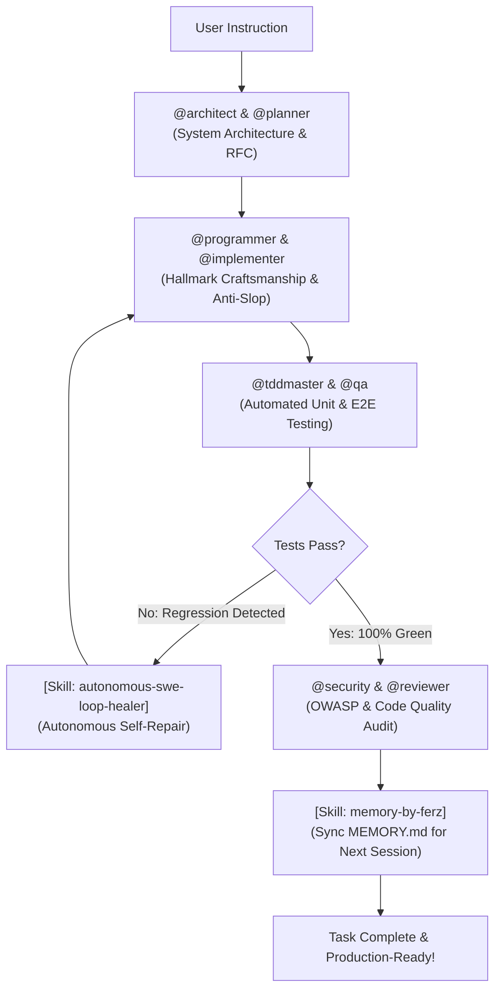

<div align="center">

# ⚡ FREEBUFF-POWER SUPREME ULTRA
### The World's Most Advanced Multi-Agent Swarm, Skills Engine & Anti-Ban Shield for Freebuff

[](https://opensource.org/licenses/MIT)
[](#-specialized-sub-agents-roster)
[](#-modular-skills-catalog)
[](#-enterprise-anti-ban--anti-suspend-shield)
[](#-quick-installation-1-line-installer)

```
  ______ _____  ______ ______ ____  _    _ ______ ______   _____   ______          ________ _____  
 |  ____|  __ \|  ____|  ____|  _ \| |  | |  ____|  ____| |  __ \ / __ \ \        / /  ____|  __ \ 
 | |__  | |__) | |__  | |__  | |_) | |  | | |__  | |__    | |__) | |  | \ \  /\  / /| |__  | |__) |
 |  __| |  _  /|  __| |  __| |  _ <| |  | |  __| |  __|   |  ___/| |  | |\ \/  \/ / |  __| |  _  / 
 | |    | | \ \| |____| |____| |_) | |__| | |    | |      | |    | |__| | \  /\  /  | |____| | \ \ 
 |_|    |_|  \_\______|______|____/ \____/|_|    |_|      |_|     \____/   \/  \/   |______|_|  \_\
```

**Freebuff-Power** transforms Freebuff from a single chatbot into an autonomous **38-Agent Engineering Swarm** armed with **1,025 Modular Skills**, zero-bloat on-demand loading, and enterprise-grade anti-ban safety.

[Instalasi 1 Baris](#-quick-installation-1-line-installer) • [Fitur Utama](#-fitur-utama) • [Panduan CLI](#-cli-command-palette) • [Roster Sub-Agents](#-specialized-sub-agents-roster) • [Katalog Skills](#-modular-skills-catalog)

</div>

---

## ⚡ Quick Installation (1-Line Universal Installer)

Cukup salin dan jalankan **satu baris perintah** ini di terminal Linux atau macOS kamu:

```bash
curl -fsSL https://raw.githubusercontent.com/FerzDevZ/freebuff-power/main/install.sh | bash
```

*(Atau jika menggunakan Wget)*:
```bash
wget -qO- https://raw.githubusercontent.com/FerzDevZ/freebuff-power/main/install.sh | bash
```

> 💡 **Apa yang dilakukan installer ini secara otomatis?**
> 1. Mengunduh seluruh pustaka **38 Sub-Agents** dan **1,025 Modular Skills**.
> 2. Memasang executable CLI `freebuff-power` ke `~/.local/bin/` dan mengonfigurasi `$PATH`.
> 3. Menyiapkan master template di `~/.freebuff-superpower/`.
> 4. Selesai dalam 2 detik tanpa perlu clone atau `cd` manual!

---

## 🌟 Fitur Utama

- 👥 **38 Specialized Sub-Agents**: Persona ahli dari `@architect`, `@programmer`, `@design-engineer`, `@backend`, `@database`, `@tddmaster`, `@security`, hingga `@sre`.
- 🧰 **1,025 Modular Engineering Skills**: Pustaka lengkap mencakup arsitektur bersih, Next.js 15, FastAPI, Go concurrency, Rust, PostgreSQL internals, Playwright E2E, OWASP security, hingga WebGL.
- 🛡️ **Enterprise Anti-Ban & Anti-Suspend Shield**: Sanitasi identitas virtual dinamis (`anon_<uuid_v4>`), reset residual lockfiles, dan proteksi telemetry otomatis.
- ⚡ **Tiered On-Demand Loading**: `AGENTS.md` bertindak sebagai Master Index tipis & cepat; detail modul dibaca on-demand sehingga **bebas dari payload 413 / context blowout**.
- 🔄 **Self-Healing Auto-Verify Loop**: Otomatis menjalankan compiler/test checks dan memperbaiki regresi secara otonom tanpa intervensi manual.
- 🧠 **Persistent Project Memory**: Sinkronisasi otomatis file `MEMORY.md` untuk menjaga keputusan arsitektur dan status tugas antar sesi.
- 💬 **Session & Chat Switcher**: Pindah dan lanjutkan percakapan coding kapan saja dengan `freebuff-power continue` atau `freebuff-power session resume`.
- 🪄 **Prompt Composer**: Menganalisis kebutuhan tugas dan merekomendasikan kombo sub-agent & skill terbaik via `freebuff-power compose`.

---

## 🎮 CLI Command Palette

```text
========================================================================================
⚡ FREEBUFF-POWER — Supreme Multi-Agent, Skills & Anti-Ban Controller (v3.8)
========================================================================================

🔥 PERINTAH UTAMA:
  freebuff-power start             [Rekomendasi] Injeksi All-in-One + Anti-Ban + Buka Freebuff
  freebuff-power spawn <agent>     Luncurkan Freebuff dengan persona spesifik (misal: architect)
  freebuff-power init [dir]        Injeksi AGENTS.md & .freebuff/ ke folder tanpa membuka sesi
  freebuff-power run               Jalankan sesi Freebuff dengan Anti-Ban aktif

💬 MANAJEMEN SESI & PROMPT COMPOSER:
  freebuff-power compose <task>    Analisis & buatkan prompt kombo agent + skill terbaik
  freebuff-power continue          Lanjutkan sesi percakapan/coding terakhir
  freebuff-power session list      Daftar histori proyek dan riwayat sesi chat

🛡️ PEMELIHARAAN, UPDATE & ANTI-BAN:
  freebuff-power clean             Reset UUID telemetry & residual lock (Anti-Ban Fresh)
  freebuff-power doctor            Pemeriksaan kesehatan sistem (integritas template)
  freebuff-power update            Update pustaka Skills & Agents ke versi rilis terbaru

🔍 EKSPLORASI & PANDUAN:
  freebuff-power search <keyword>  Cari Sub-Agent atau Modular Skills
  freebuff-power info <name>       Lihat SOP & dokumentasi lengkap Agent atau Skill
  freebuff-power list              Daftar seluruh 38 Sub-Agents & 1,025 Skills
========================================================================================
```

---

## 👥 Specialized Sub-Agents Roster (38 Elite Agents)

| Sub-Agent | Focus & Responsibility |
|---|---|
| `@architect` | System architecture, technical RFCs, component boundaries & schema design |
| `@programmer` | Ultimate precision engineer, strict typing, Hallmark craftsmanship, zero AI slop |
| `@backend` | High-throughput backend APIs, microservices, auth, DB transactions |
| `@frontend` | Modern reactive UI (Next.js/React 19/Tailwind), micro-interactions |
| `@design-engineer`| Design systems, OKLCH color palettes, fluid typography, bespoke layouts |
| `@database` | Schema modeling, indexing, query execution plans, migration safety |
| `@tddmaster` | Red-Green-Refactor test-driven development, edge-case coverage |
| `@qa` | Comprehensive unit/integration/E2E test suites (Playwright/Vitest) |
| `@security` | OWASP Top 10 hardening, token security, zero secret leaks, input validation |
| `@reviewer` | Cognitive load reduction, code complexity analysis, anti-slop audit |
| `@debugger` | Error traceback analysis, reproduction, and minimal surgical patching |
| `@devops` | Docker multi-stage builds, CI/CD GitHub Actions, infrastructure |
| `@sre` | SLO monitoring, incident runbooks, health probes, resilience |
| `@fintech-architect` | Payment lifecycle, idempotency keys, Stripe/Xendit webhooks, ledgers |
| `@ai-engineer` | RAG pipelines, vector embeddings (pgvector/Qdrant), LLM evaluations |
| `@mobile-engineer` | Cross-platform & native mobile apps (Flutter, React Native, SwiftUI) |
| `@websocket-realtime` | Real-time WebSockets, Server-Sent Events, Redis Pub/Sub backends |
| `@chaos-tester` | Fault injection, k6 load testing, circuit breaker verification |
| `@refactor-expert` | Legacy code modernization, clean architecture, zero behavioral regressions |
| `@seo-growth` | Programmatic SEO (pSEO), Schema JSON-LD, Core Web Vitals (INP/LCP) |

*(Serta 9 sub-agent spesialis lainnya di `superpower/agents/`)*

---

## 🧰 Modular Skills Catalog (1,025 Skills)

Skills dikelompokkan ke dalam 8 pilar rekayasa perangkat lunak:
1. **Architecture & Design (110+ skills)**: Clean Architecture, CQRS, Event Sourcing, Domain-Driven Design, API Design (REST/gRPC/GraphQL).
2. **Backend Polyglot (180+ skills)**: FastAPI, NestJS, Go Concurrency & Channels, Rust Tokio/Axum, Spring Boot, Deno 2.0, Bun runtime.
3. **Frontend & Mobile (220+ skills)**: Next.js 15, React 19, Vue/Nuxt 3, Tailwind Fluid Typography, Bento Grid, Radix UI, Framer Motion, SwiftUI, Jetpack Compose.
4. **Database & OLAP (120+ skills)**: PostgreSQL Internals & Indexing, ClickHouse, DuckDB, Redis Streams, MongoDB, SQLite Edge WAL.
5. **Testing & QA (130+ skills)**: Vitest TDD, Playwright E2E & Visual Regression, k6 Load & Soak Testing, Stryker Mutation Testing, Pact.
6. **Security & AppSec (115+ skills)**: OWASP Top 10, Authflow PKCE, Passkeys WebAuthn, Prompt Injection Guardrails, SBOM Provenance.
7. **AI & Machine Learning (90+ skills)**: RAG Pipelines, Vector DB (pgvector/Qdrant), LLM Evals, vLLM / Ollama Local Deploy, AI Observability.
8. **Anti-Slop & Performance (60+ skills)**: Anti-Waffle Writing, Anti-Slop AI, Cognitive Load Minimizer, Core Web Vitals (INP/LCP), DevTools Heap Profiler.

---

## 🔄 Supreme Multi-Agent Swarm Workflow



---

## 🛡️ Enterprise Anti-Ban & Anti-Suspend Shield

1. **Synthetic Dynamic Fingerprinting**: Setiap eksekusi `freebuff-power start` atau `clean` menghasilkan UUID unik acak (`anon_<uuid_v4>`), memutuskan rantai pelacakan sesi server.
2. **Residual Lock Janitor**: Membersihkan socket usang dan file lock orphaned di `~/.config/manicode/` untuk mencegah konflik status instance.
3. **Secret Redaction Gatekeeper**: Aturan mutlak di semua persona untuk menyamarkan token rahasia, API key, dan credential.
4. **Token Budget Economy**: Arsitektur *Tiered On-Demand Loading* memastikan context window tidak pernah overflow (Mencegah error HTTP 413).

---

## 📄 License

Proyek ini dilisensikan di bawah lisensi **MIT License** — lihat berkas [LICENSE](LICENSE) untuk rincian lengkap.
