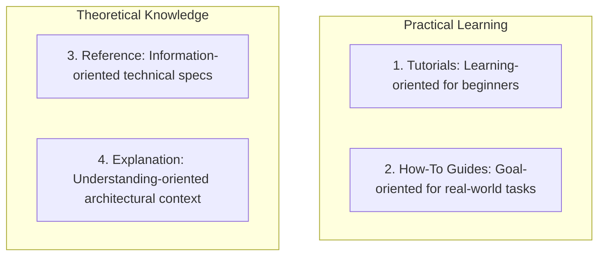

# Architecture Decision Records (ADR) & Technical Documentation Master

This skill provides industry standards for recording architectural decisions, managing technical RFCs, and structuring software documentation using the Diátaxis framework.

---

## 📚 The Diátaxis Documentation Framework

---

## 🎯 ADR Production Invariants

1. **Immutable Historical Record**: Once an ADR is `Accepted`, it is never modified. If a decision is superseded, create a new ADR referencing the old one (`Supersedes: ADR-0002`).
2. **Context & Consequences**: Every ADR must document why a choice was made and explicitly list the trade-offs and negative consequences accepted.

---

## 📋 Prosedur Eksekusi

1. **Pola Diátaxis**:
   - Baca [references/diataxis-documentation-framework.md](./references/diataxis-documentation-framework.md).
2. **Template ADR**:
   - Terapkan format dari [resources/adr-template.md](./resources/adr-template.md).
3. **Scaffold ADR Baru**:
   - Jalankan `bash skills/adr-tech-documentation/scripts/new-adr.sh "<judul_keputusan>"`.