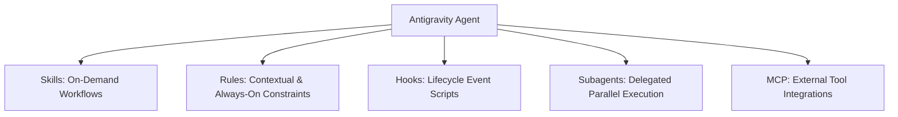

# Antigravity Agent Customization Expert

This skill provides comprehensive guidelines for extending Antigravity's capabilities via Skills, Rules, Hooks, Subagents, and Plugins.

---

## 🧩 Customization Architecture

---

## 🛠️ Step-by-Step Customization Workflow

1. **Creating a Skill**:
   - Create `skills/<skill_name>/SKILL.md` with valid YAML frontmatter (`name` and `description`).
   - Use `references/` for large documentation (progressive disclosure) to preserve token context.
   - Put helper tools in `scripts/` and configuration templates in `resources/`.

2. **Creating Rules (`GEMINI.md` / `AGENTS.md`)**:
   - Enforce repository-specific guidelines, coding styles, or API constraints.
   - Use `always_on` for universal constraints or `model_decision` for targeted triggers.

3. **Configuring Hooks (`hooks.json`)**:
   - Attach pre-tool execution, post-tool execution, or startup scripts.

4. **Validating Skills**:
   - Run `bash scripts/validate-skills.sh` to ensure compliance.