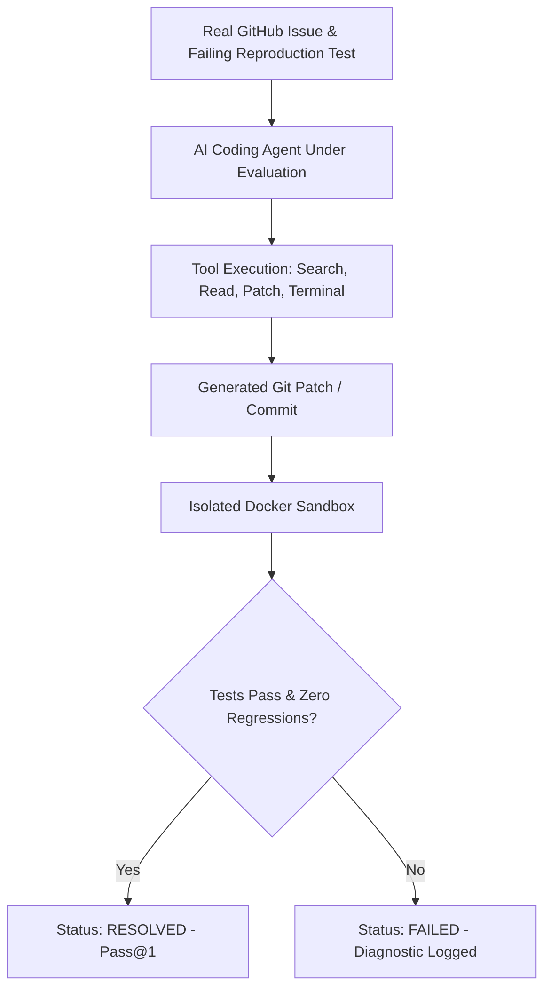

# AI Coding Agent Benchmarking & SWE-bench Evaluator Master

This skill provides an objective evaluation harness to test, measure, and score autonomous AI software engineering agents against production coding benchmarks and pass@1 accuracy.

---

## 🏆 Agent Benchmarking Framework

---

## 🎯 Production Invariants

1. **Clean Hermetic Sandbox**: Always evaluate agent patches in an isolated container sandbox without network access to prevent test leakage.
2. **Pass@1 Rigor**: Measure first-attempt success rate without human intervention in the loop.
3. **Tool Call Efficiency Metric**: Track the ratio of useful tool calls vs unnecessary exploratory calls.

---

## 📋 Prosedur Eksekusi

1. **Rubrik Evaluasi SWE-bench**:
   - Baca [references/swe-bench-rubric.md](./references/swe-bench-rubric.md).
2. **Harness Evaluasi**:
   - Format: [resources/eval-harness.json](./resources/eval-harness.json).
3. **Jalankan Benchmark Suite**:
   - Jalankan `python3 skills/ai-coding-agent-benchmarking-evaluator/scripts/run-agent-benchmark.py`.
