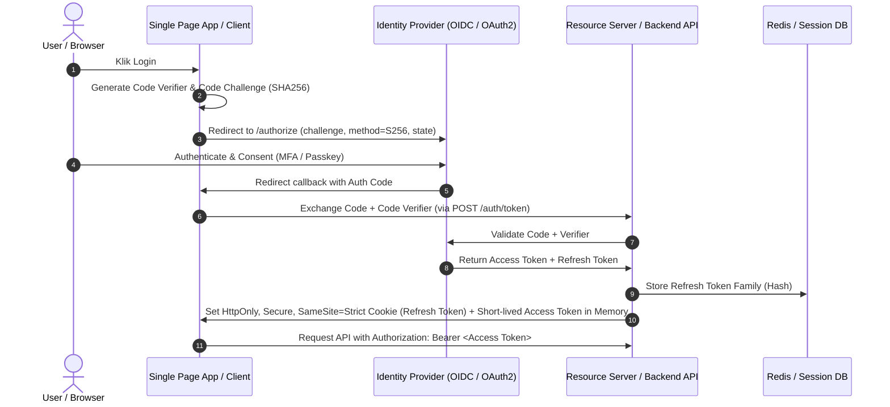

# Auth Flow & Identity Security Architect

This skill provides bulletproof blueprints for authentication, authorization, token lifecycle management, and identity protection.

---

## 🔐 The Modern OAuth 2.0 + PKCE Auth Flow

---

## 🛡️ Core Security Invariants for Auth

1. **Storage Rules**:
   - ❌ Never store Access Tokens or Refresh Tokens in `localStorage` or `sessionStorage` (vulnerable to XSS).
   - ✅ Store Refresh Tokens in **`HttpOnly, Secure, SameSite=Strict / Lax`** cookies.
   - ✅ Keep short-lived Access Tokens (5-15 mins) strictly **in-memory**.

2. **Refresh Token Rotation & Family Revocation**:
   - Every time a refresh token is used, invalidate it and issue a new one.
   - If an already-invalidated refresh token is reused, treat it as a breach: **revoke the entire token family** (force logout on all devices).

3. **Passkeys & WebAuthn First**:
   - Favor FIDO2 / WebAuthn passwordless authentication (cryptographic challenge-response via biometric secure enclave).

---

## 📋 Prosedur Eksekusi

1. **Memilih Flow Sesuai Kebutuhan**:
   - SPA / Mobile App: Gunakan **OAuth 2.0 Authorization Code with PKCE** ([references/oauth2-pkce-flow.md](./references/oauth2-pkce-flow.md)).
   - Machine-to-Machine: Gunakan **Client Credentials Flow** with mTLS or Private Key JWT.
2. **Implementasi Token Rotation**:
   - Terapkan pola dari [references/jwt-rotation-cookies.md](./references/jwt-rotation-cookies.md) dan middleware [resources/auth-middleware-pattern.ts](./resources/auth-middleware-pattern.ts).
3. **Audit Token Security**:
   - Jalankan `python3 skills/authflow-security-architect/scripts/validate-jwt-security.py <jwt_sample>` untuk memeriksa kelemahan klaim token.