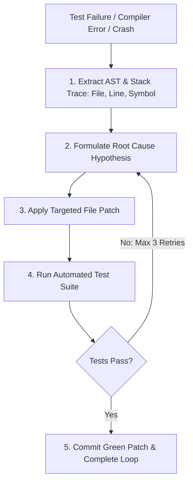

# Autonomous SWE Loop & Traceback Self-Healer Master

This skill provides an autonomous feedback loop for AI software engineering agents to diagnose stack traces, isolate root causes, apply patches, and verify test suites autonomously.

---

## 🔁 Autonomous SWE Loop Architecture

---

## 🎯 Production Invariants

1. **Max 3 Self-Healing Retries**: If a fix fails after 3 consecutive iterations, revert uncommitted changes to prevent compounding error states.
2. **Never Mask Errors**: Never wrap failing code in bare `except: pass` or silence TypeScript errors with `any`. Address the root cause.
3. **Automated Regression Guard**: Run both the failing test AND all existing regression tests before declaring success.

---

## 📋 Prosedur Eksekusi

1. **Protokol Self-Healing**:
   - Baca [references/loop-healing-protocol.md](./references/loop-healing-protocol.md).
2. **Kebijakan Eksekusi**:
   - Format: [resources/healing-policy.json](./resources/healing-policy.json).
3. **Jalankan Loop Healer**:
   - Jalankan `python3 skills/autonomous-swe-loop-healer/scripts/run-swe-healing-loop.py "<test_command>"`.