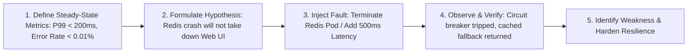

# Chaos Engineering & Resilience Master

This skill provides an empirical framework to test distributed system reliability by injecting controlled failures and proving steady-state hypotheses.

---

## 💥 Chaos Engineering Lifecycle

---

## 🎯 Production Invariants

1. **Blast Radius Containment**: Always run chaos experiments with automated abort triggers (`stop if overall error rate exceeds 5%`).
2. **Steady-State Hypothesis**: Never run an experiment without measurable baseline indicators (Prometheus latency histograms, error counters).
3. **Graceful Degradation**: If an upstream dependency fails, downstream services must degrade gracefully (e.g. show cached recommendations or informative fallback) instead of rendering HTTP 500 pages.

---

## 📋 Prosedur Eksekusi

1. **Formulasi Hipotesis**:
   - Baca [references/steady-state-hypothesis.md](./references/steady-state-hypothesis.md).
2. **Template Eksperimen Chaos**:
   - Format: [resources/chaos-experiment.json](./resources/chaos-experiment.json).
3. **Simulasi Latency & Fault**:
   - Jalankan `bash skills/chaos-engineering-resilience/scripts/simulate-latency.sh`.