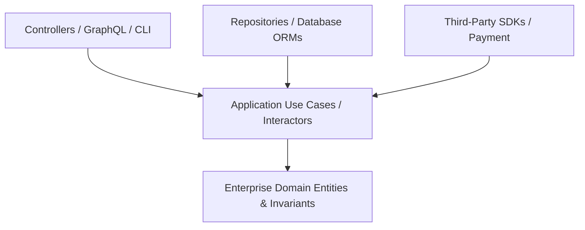

# Clean Architecture & Refactoring Master

This skill provides patterns for building maintainable, loosely coupled, and highly testable applications by strictly enforcing the Dependency Inversion Principle and clean layer separation.

---

## 🏛️ Clean / Hexagonal Architecture Layers

**The Fundamental Dependency Rule**:
Dependencies point **inward only**. Domain entities and business use cases must NEVER import frameworks, ORMs, HTTP controllers, or external libraries.

---

## 📋 Prosedur Eksekusi

1. **Struktur Lapisan & Port/Adapters**:
   - Terapkan pola Port & Adapter dari [references/solid-and-hexagonal.md](./references/solid-and-hexagonal.md).
2. **Katalog Code Smells & Solusi Refactoring**:
   - Rujuk solusi perbaikan di [references/code-smells-catalog.md](./references/code-smells-catalog.md).
3. **Template Use Case**:
   - Gunakan boilerplate di [resources/use-case-template.ts](./resources/use-case-template.ts).
4. **Verifikasi Ketergantungan**:
   - Jalankan `bash skills/clean-architecture-refactoring/scripts/check-dependency-rule.sh`.