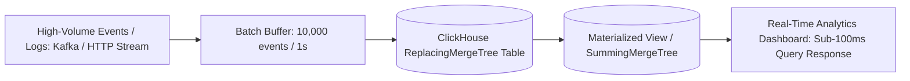

# ClickHouse & Real-Time OLAP Analytics Master

This skill provides enterprise standards for architecting column-oriented, ultra-fast analytical data warehouses that query billions of events in milliseconds.

---

## ⚡ ClickHouse Real-Time Analytics Pipeline

---

## 🎯 Production Invariants

1. **Batch Ingestion Only**: Never perform single-row `INSERT` queries in ClickHouse. Always batch in groups of $\ge 1,000 - 10,000$ rows or use Async Inserts (`async_insert = 1`).
2. **Optimal Sorting Key (`ORDER BY`)**: Place lowest-cardinality filtering columns first in the table's `ORDER BY` clause to maximize primary index compression and skipping.
3. **Materialized Views for Pre-aggregation**: Pre-aggregate heavy metrics (counts, sums, percentiles) via `SummingMergeTree` / `AggregatingMergeTree`.

---

## 📋 Prosedur Eksekusi

1. **Panduan MergeTree Engines**:
   - Baca [references/mergetree-engine-tuning.md](./references/mergetree-engine-tuning.md).
2. **Template Schema OLAP**:
   - Rujuk [resources/telemetry-schema.sql](./resources/telemetry-schema.sql).
3. **Audit Query ClickHouse**:
   - Jalankan `bash skills/clickhouse-analytics-engineer/scripts/check-clickhouse-query.sh`.
