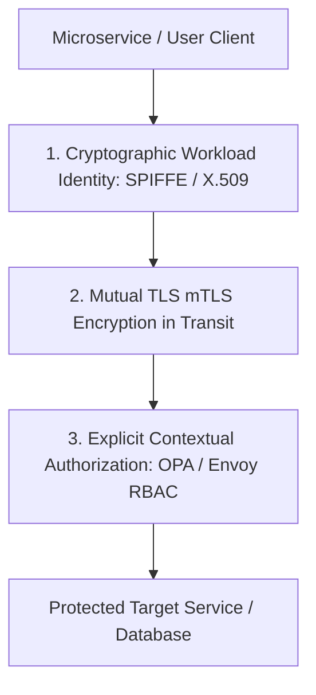

# Cloud Security & Zero-Trust Architecture Master

This skill provides enterprise standards for implementing the "Never Trust, Always Verify" Zero-Trust security paradigm across multi-cloud and Kubernetes environments.

---

## 🔒 The Zero-Trust Security Model

---

## 🎯 Production Invariants

1. **Strict mTLS Across All Workloads**: Enable `STRICT` PeerAuthentication in Service Mesh (Istio / Linkerd) to encrypt and authenticate all pod-to-pod communications.
2. **Short-Lived Ephemeral Certificates**: Rotate workload identity certificates every 12 to 24 hours automatically via SPIFFE/SPIRE or cert-manager.
3. **No Wildcard IAM Actions**: Ban `Action: "*"` and `Resource: "*"` in cloud IAM policies.

---

## 📋 Prosedur Eksekusi

1. **Prinsip Arsitektur Zero-Trust**:
   - Baca [references/zero-trust-principles.md](./references/zero-trust-principles.md).
2. **Template Istio PeerAuthentication**:
   - Rujuk [resources/peer-authentication-istio.yaml](./resources/peer-authentication-istio.yaml).
3. **Audit Kebijakan IAM**:
   - Jalankan `python3 skills/cloud-security-zero-trust/scripts/audit-iam-policies.py <iam_policy.json>`.