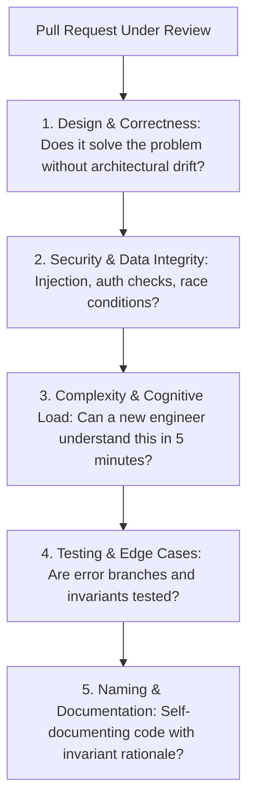

# Code Review Excellence & PR Auditor

This skill provides an objective, senior-level code review rubric based on Google and Meta engineering practices to maximize code health, maintainability, and security while minimizing reviewer turnaround time.

---

## 🔍 The Code Review Assessment Hierarchy

---

## 🎯 Production Invariants

1. **Small, Atomic PRs**: PRs should ideally be `< 400 lines of code`. Large PRs receive superficial reviews and introduce 2x more bugs.
2. **Distinguish Nitpicks from Blockers**: Prefix non-blocking suggestions with `[Nit]` or `[Optional]` so authors know they can merge without blocking.
3. **Praise Good Code**: Acknowledge elegant solutions, comprehensive tests, and clean refactorings.

---

## 📋 Prosedur Eksekusi

1. **Rubrik Code Review Standar**:
   - Baca [references/google-code-review-rubric.md](./references/google-code-review-rubric.md).
2. **Template Review**:
   - Gunakan format di [resources/pr-review-checklist.md](./resources/pr-review-checklist.md).
3. **Analisis Diff PR**:
   - Jalankan `python3 skills/code-review-excellence-auditor/scripts/audit-pr-diff.py <git_diff_file>`.