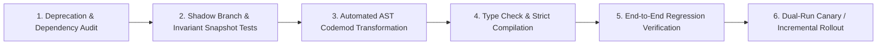

# Codebase Refactor & Major Migration Master

This skill provides an enterprise methodology for executing complex repository migrations, AST-based codemods, and type-system hardening with regression-free safety guarantees.

---

## 🔄 The Multi-Stage Migration Pipeline

---

## 🎯 Production Invariants

1. **Step-by-Step Atomic PRs**: Never migrate an entire monolith in a single unreviewable PR. Migrate route-by-route or module-by-module.
2. **Pre-Migration Snapshot Testing**: Take API response snapshots before touching code to verify exact byte-for-byte behavioral parity.
3. **No Suppressed Lint Warnings**: Ban `@ts-ignore` or `eslint-disable` workarounds during migrations.

---

## 📋 Prosedur Eksekusi

1. **Panduan AST Codemods**:
   - Baca [references/ast-codemods-guide.md](./references/ast-codemods-guide.md).
2. **Template Rencana Migrasi**:
   - Format: [resources/migration-plan.md](./resources/migration-plan.md).
3. **Scan API Usang**:
   - Jalankan `python3 skills/codebase-refactor-migration-pro/scripts/scan-deprecated-apis.py <target_directory>`.