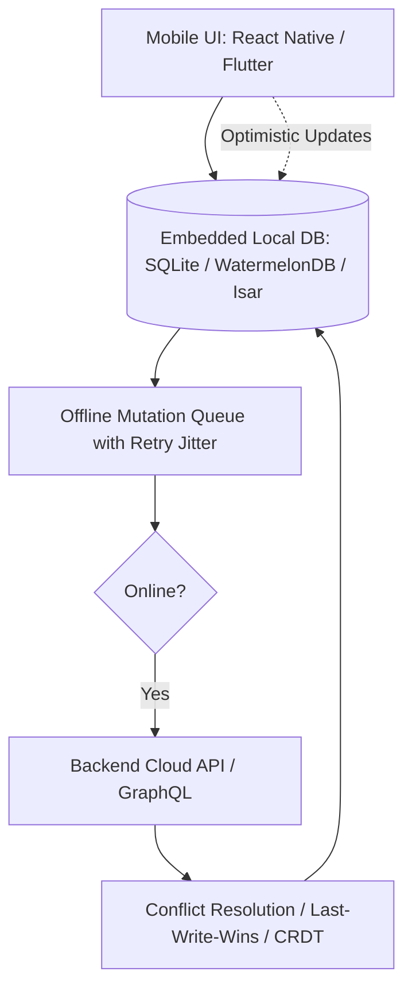

# Cross-Platform Mobile Master (Flutter & React Native)

This skill provides production standards for architecting high-performance mobile applications with offline-first synchronization, native bridge optimizations, and smooth 60/120 FPS animations.

---

## 📱 Offline-First Mobile Architecture

---

## 🎯 Production Invariants

1. **Offline-First by Default**: The UI reads and writes directly to local SQLite/WatermelonDB. Background synchronization syncs mutations when network connectivity returns.
2. **Deep Linking Integrity**: Configure universal links (iOS `apple-app-site-association`) and Android App Links (`assetlinks.json`) with strict schema validation.
3. **Memory & FPS Guardrails**: Avoid memory leaks in infinite scroll lists by utilizing virtualized lists (`FlashList` in React Native, `ListView.builder` in Flutter).

---

## 📋 Prosedur Eksekusi

1. **Pola Offline-First Sync**:
   - Baca [references/offline-first-sync.md](./references/offline-first-sync.md).
2. **Template Sync Engine**:
   - Rujuk [resources/sync-service.ts](./resources/sync-service.ts).
3. **Audit Kesiapan Mobile**:
   - Jalankan `bash skills/crossplatform-mobile-flutter-rn/scripts/check-mobile-deps.sh`.