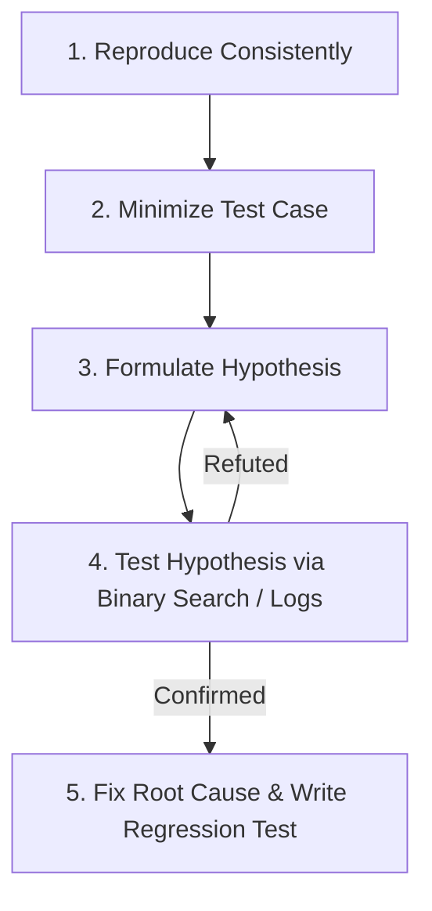

# Systematic Debugging Heuristics

## 🔍 The 5-Step Scientific Debugging Method

### Heuristic 1: The Principle of Locality (Binary Search)
If a bug occurs in a pipeline of 10 stages:
- Test stage 5.
- If stage 5 is bad $\rightarrow$ bug is in stages 1..4.
- If stage 5 is good $\rightarrow$ bug is in stages 6..10.
- Never guess across all 10 stages at once.

### Heuristic 2: Differential Diagnosis
Ask:
- What changed recently? (Git log, environment variables, dependency upgrades).
- What works vs. what does not work? (e.g. works on Chrome, fails on Safari; works with 1 user, fails with 100).

### Heuristic 3: Rubber Duck Debugging (Deconstruction)
Explain line by line what the code is ACTUALLY doing, not what you INTENDED it to do.
