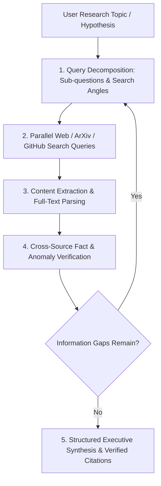

# Deep Research & Knowledge Synthesis Master

This skill provides an autonomous multi-step investigation protocol inspired by frontier deep research systems (Perplexity Deep Research, OpenAI Deep Research).

---

## 🔬 Autonomous Deep Research Protocol

---

## 🎯 Production Invariants

1. **Mandatory Primary Sources**: Never cite summary aggregators when primary documentation, RFCs, or benchmark papers are available.
2. **Confidence Scoring**: Highlight conflicting claims explicitly with confidence brackets (`[High Confidence: 95%]`, `[Disputed/Unverified]`).
3. **Structured Citation Footnotes**: Format citations with full URLs and access dates.

---

## 📋 Prosedur Eksekusi

1. **Panduan Sintesis Riset**:
   - Baca [references/deep-research-methodology.md](./references/deep-research-methodology.md).
2. **Template Laporan Eksekutif**:
   - Rujuk [resources/research-report-template.md](./resources/research-report-template.md).
3. **Eksekutor Multi-Query**:
   - Jalankan `python3 skills/deep-research-autonomous-agent/scripts/run-deep-research.py "<research_topic>"`.