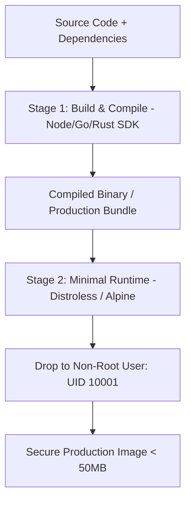

# Docker & Containerization Master

This skill provides production standards for building ultra-slim, secure, and fast-building container images using Docker multi-stage builds, BuildKit cache mounts, and non-root execution.

---

## 📦 Multi-Stage Container Architecture

---

## 🎯 Production Invariants

1. **Non-Root User by Default**: Never run container processes as `USER root`. Always create and switch to a dedicated non-root user (`USER appuser`).
2. **BuildKit Cache Mounts**: Use `--mount=type=cache,target=/root/.cache` to accelerate repeated dependency installations.
3. **No Secrets in Image Layers**: Never pass secrets via `ARG` or `ENV`. Use BuildKit secret mounts (`--mount=type=secret`).

---

## 📋 Prosedur Eksekusi

1. **Optimasi Multi-Stage & Caching**:
   - Baca [references/multi-stage-optimization.md](./references/multi-stage-optimization.md).
2. **Template Dockerfile & Compose**:
   - Dockerfile: [resources/Dockerfile](./resources/Dockerfile).
   - Docker Compose: [resources/docker-compose.yml](./resources/docker-compose.yml).
3. **Audit Keamanan Container**:
   - Jalankan `bash skills/docker-container-master/scripts/lint-dockerfile.sh`.