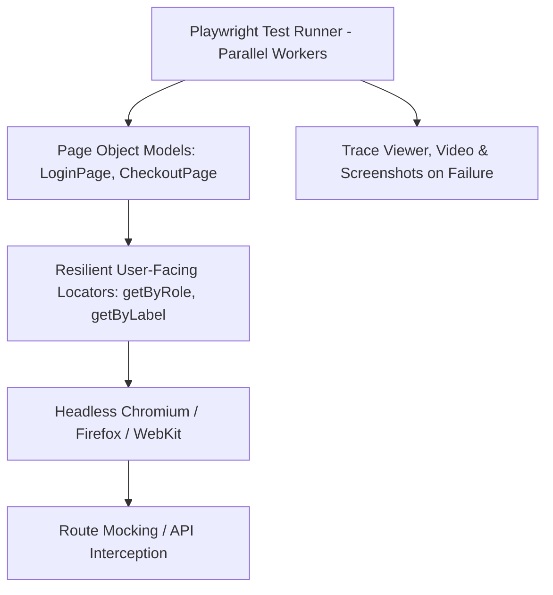

# Playwright E2E Test Automation Master

This skill provides industry standards for creating flake-free, fast, and maintainable end-to-end browser tests using Playwright and the Page Object Model.

---

## 🎭 E2E Testing Architecture

---

## 🎯 Production Invariants

1. **User-Facing Locators Only**: Always use `page.getByRole()`, `page.getByLabel()`, and `page.getByText()`. Never use fragile CSS/XPath selectors like `div > span:nth-child(3)`.
2. **Auto-Waiting**: Never insert arbitrary `page.waitForTimeout(5000)`. Rely on Playwright's built-in web-first assertions (`await expect(locator).toBeVisible()`).
3. **Trace on Retry**: Always enable `trace: 'on-first-retry'` to inspect complete DOM snapshots and network logs on test failures.

---

## 📋 Prosedur Eksekusi

1. **Pola Page Object Model (POM)**:
   - Baca [references/page-object-model.md](./references/page-object-model.md).
2. **Template Test Spec**:
   - Terapkan kode dari [resources/login.spec.ts](./resources/login.spec.ts).
3. **Jalankan Test di CI**:
   - Jalankan `bash skills/e2e-playwright-automation/scripts/run-playwright-ci.sh`.