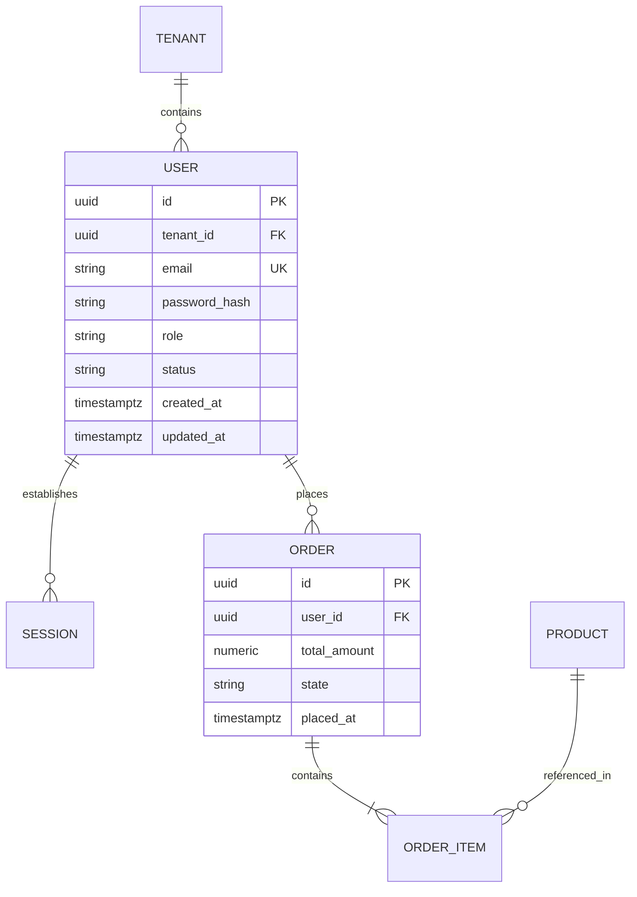

# ERD & Data Modeling Expert

This skill provides an end-to-end framework for relational and document database modeling, ensuring high data integrity, optimal indexing, and zero-downtime schema evolution.

---

## 🏗️ The Data Modeling Lifecycle

---

## 🎯 Core Engineering Rules for ERD & Schema Design

1. **Primary Key Strategy**:
   - Favor **UUIDv7** or **ULID** for globally unique, time-ordered, distributed-safe keys without B-Tree fragmentation.
   - For high-write internal append logs, `BIGINT GENERATED ALWAYS AS IDENTITY` is also acceptable.

2. **Normalization (1NF -> 3NF / BCNF)**:
   - **1NF**: Atomic columns, no repeating groups.
   - **2NF**: No partial dependency on composite keys.
   - **3NF**: No transitive dependency (non-key columns depend ONLY on the primary key).
   - *Denormalize deliberately* only for high-throughput analytical reads (e.g. read replicas or materialized views).

3. **Auditing & Temporal State**:
   - Always include `created_at TIMESTAMPTZ NOT NULL DEFAULT NOW()` and `updated_at TIMESTAMPTZ NOT NULL DEFAULT NOW()`.
   - Never use naive boolean `is_deleted`; use `deleted_at TIMESTAMPTZ NULL` with partial unique index (`WHERE deleted_at IS NULL`).

4. **Foreign Keys & Cascades**:
   - Explicitly define `ON DELETE RESTRICT` or `ON DELETE CASCADE`. Never leave constraint behavior implicit.

---

## 📋 Prosedur Eksekusi

1. **Drafting the ERD**:
   - Identifikasi entitas, relasi (1:1, 1:N, N:M junction table), dan kardinalitas.
   - Baca [references/normalization-indexing.md](./references/normalization-indexing.md) untuk strategi indexing.
2. **Writing DDL & Constraints**:
   - Gunakan template di [resources/template-schema.sql](./resources/template-schema.sql).
3. **Planning Zero-Downtime Migration**:
   - Terapkan pola *Expand-Contract* dari [references/zero-downtime-migrations.md](./references/zero-downtime-migrations.md).
4. **Generate ERD Diagram**:
   - Jalankan `python3 skills/erd-data-modeling-expert/scripts/generate-erd-mermaid.py` untuk menghasilkan Mermaid ERD dari skrip SQL.