# ⚡ Ferz All-Skills Master Omniscient Orchestrator (160 Superpower Skills)

**Ferz All-Skills (`ferz-skills` / `ferz-all-skills`)** adalah *Master Omniscient Gateway* untuk Hermes Agent, Antigravity, dan AI Coding Assistants. 

Saat pengguna memicu kata kunci **`ferz-all-skills`**, **`ferz-skills`**, atau **`gunakan skills itu`**, Anda **secara otomatis mengaktifkan seluruh kekuatan 160 skill** secara terkoordinasi dan multi-disiplin tanpa perlu memanggil skill satu per satu!

---

## 🧭 Master Capability Domains (160 Superpower Skills Loaded)

```mermaid
graph TD
    Root[⚡ ferz-all-skills Master Orchestrator] --> D1[1. 🎨 Vibe Coding & Web Aesthetics: 22 Skills]
    Root --> D2[2. ⚡ Hyper-Performance & Web Speed: 18 Skills]
    Root --> D3[3. 🔍 SEO, Programmatic SEO & GEO AI Search: 10 Skills]
    Root --> D4[4. 🗄️ Database, Supabase & OLAP: 18 Skills]
    Root --> D5[5. 🧠 Anti-Slop AI, SDLC & Guardrails: 15 Skills]
    Root --> D6[6. 🧘 Berpikir Programmer Sepuh: 14 Skills]
    Root --> D7[7. 💻 Polyglot Languages: 15 Skills]
    Root --> D8[8. 🏛️ Distributed Systems & Concurrency: 15 Skills]
    Root --> D9[9. 🔒 Security, DevSecOps & Fintech: 14 Skills]
    Root --> D10[10. ⚡ 0-to-1 Instant Vibe Prototyping: 10 Skills]
    Root --> D11[11. ☁️ DevOps, Mutation QA & SRE: 19 Skills]
```

---

## 🎯 Aturan Eksekusi Otomatis (*Autonomous Execution Invariants*)

1. **Anti-Slop AI Law**:
   - Langsung hasilkan kode produksi utuh (*production-ready*), idiomatik, dan teruji.
   - Dilarang keras menggunakan kata pengantar bertele-tele (*no corporate waffle*), komentar pura-pura (`// TODO:`), atau potongan ellipsis (`...`).
2. **First-Principles & Empirical Verification**:
   - Selalu pertimbangkan alokasi memori, boundary constraints, dan penanganan kegagalan (*error boundaries*).
   - Verifikasi sintaks dan pengujian secara empiris via terminal execution.
3. **Multi-Domain Synthesis**:
   - Saat membuat Web $\rightarrow$ Otomatis padukan estetika (Three.js/GSAP/Bento) + Kecepatan (LCP/INP) + SEO/GEO + Database (Postgres/Supabase) + Keamanan (Auth PKCE/OWASP).

---

## 📋 Prosedur Eksekusi

1. **Pemeriksaan Kesehatan & Kesiapan Environment**:
   - Jalankan `bash skills/ferz-skills/scripts/doctor.sh`.
2. **Katalog & Pemetaan Intent**:
   - Rujuk [references/presets.md](./references/presets.md) dan [`SKILLS_INDEX.md`](../../SKILLS_INDEX.md).