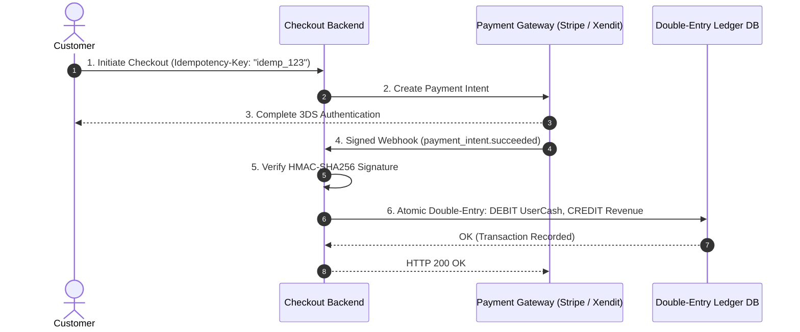

# Fintech & Payment Lifecycle Architecture Master

This skill provides enterprise standards for building zero-loss, audit-compliant financial payment systems with double-entry ledgers, cryptographic webhook verification, and state machine transaction tracking.

---

## 💳 Fintech Payment Lifecycle & Double-Entry Ledger Flow

---

## 🎯 Production Invariants

1. **Immutable Double-Entry Ledger**: Never update a balance column with `UPDATE accounts SET balance = balance + 100`. Always record immutable paired journal entries where $\sum \text{Debits} = \sum \text{Credits}$.
2. **Cryptographic Webhook Verification**: Always verify HMAC-SHA256 webhook signatures using the raw, unparsed request payload before processing events.
3. **Strict Idempotency Keys**: Reject or return cached responses for repeated payment requests using unique `Idempotency-Key` headers stored in Redis/PostgreSQL.

---

## 📋 Prosedur Eksekusi

1. **Pola Buku Besar Ganda (Double-Entry Ledger)**:
   - Baca [references/double-entry-ledger-patterns.md](./references/double-entry-ledger-patterns.md).
2. **Template Handler Webhook**:
   - Rujuk [resources/webhook-handler.ts](./resources/webhook-handler.ts).
3. **Audit Idempotensi & Keamanan**:
   - Jalankan `bash skills/fintech-payment-lifecycle-architect/scripts/check-payment-idempotency.sh`.
