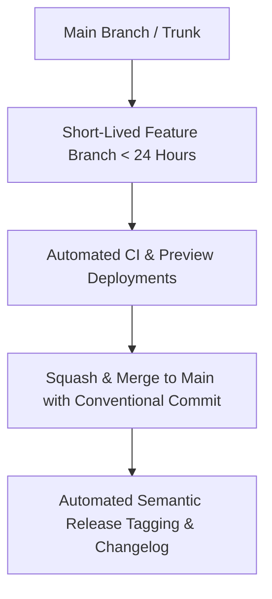

# Git, Monorepo & Trunk-Based Development Master

This skill provides industry standards for managing large monorepos, enforcing Conventional Commits, leveraging Turborepo build caching, and practicing Trunk-Based Development.

---

## 🌳 Trunk-Based Development & Monorepo Model

---

## 🎯 Production Invariants

1. **Conventional Commits**: All commit messages must strictly follow the format: `<type>(<scope>): <subject>` (e.g. `feat(auth): add passkey login support`).
2. **Short-Lived Branches**: Feature branches must live for less than 1-2 days to avoid massive merge conflicts. Use Feature Flags for work-in-progress features.
3. **Monorepo Build Caching**: Define clear inputs and outputs in `turbo.json` to avoid rebuilding unchanged packages.

---

## 📋 Prosedur Eksekusi

1. **Pola Trunk-Based Development**:
   - Baca [references/trunk-based-development.md](./references/trunk-based-development.md).
2. **Template Konfigurasi Turborepo**:
   - Config: [resources/turbo.json](./resources/turbo.json).
3. **Validasi Commit Message**:
   - Jalankan `python3 skills/git-monorepo-workflow/scripts/verify-commit-msg.py "<commit_message>"`.