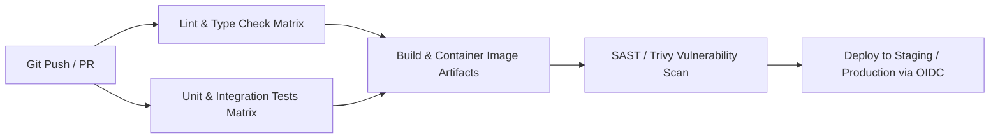

# GitHub Actions CI/CD Master

This skill provides enterprise-grade patterns for designing high-speed, secure, and cost-effective GitHub Actions CI/CD workflows.

---

## 🚀 CI/CD Pipeline Architecture

---

## 🎯 Production Invariants

1. **Least Privilege Permissions**: Always declare top-level `permissions:` explicitly (e.g. `contents: read`).
2. **Action Pinning**: Pin all third-party GitHub Actions to full commit SHAs (`uses: actions/checkout@b4ffde65...`) to protect against supply-chain attacks.
3. **No Long-Lived Cloud Keys**: Use **GitHub OIDC (OpenID Connect)** with AWS/GCP/Azure role assumption instead of storing permanent IAM access keys in repository secrets.

---

## 📋 Prosedur Eksekusi

1. **Strategi Caching & Matrix Build**:
   - Rujuk [references/ci-cd-optimization.md](./references/ci-cd-optimization.md).
2. **Template Workflow CI**:
   - Terapkan konfigurasi dari [resources/ci.yml](./resources/ci.yml).
3. **Validasi Workflow**:
   - Jalankan `bash skills/github-actions-ci-cd/scripts/validate-workflow.sh`.