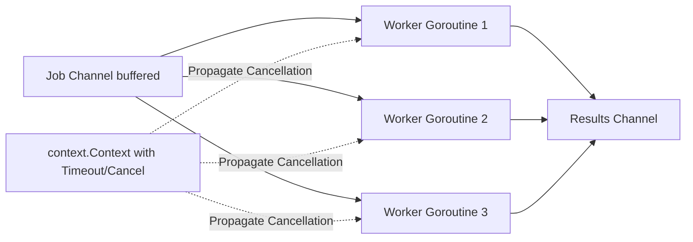

# Go Microservices & High-Concurrency Master

This skill provides idiomatic Go standards for designing concurrent microservices, handling `context.Context` cancellation, managing worker pools, and writing production HTTP/gRPC services.

---

## ⚡ Concurrency & Worker Pool Model

---

## 🎯 Production Invariants

1. **Context Propagation**: Always pass `ctx context.Context` as the very first argument in functions performing I/O or network requests. Respect `ctx.Done()`.
2. **Prevent Goroutine Leaks**: Every goroutine spawned MUST have a guaranteed exit path (via buffered channels or context cancellation).
3. **Structured Logging**: Never use `fmt.Println` or default `log.Print`. Use structured logging with Uber Zap or `log/slog`.

---

## 📋 Prosedur Eksekusi

1. **Pola Concurrency & Channel**:
   - Baca [references/goroutines-and-channels.md](./references/goroutines-and-channels.md).
2. **Boilerplate Server**:
   - Terapkan kode dari [resources/main.go](./resources/main.go).
3. **Audit Go Vet & Race Detector**:
   - Jalankan `bash skills/golang-microservices/scripts/check-go-vet.sh`.