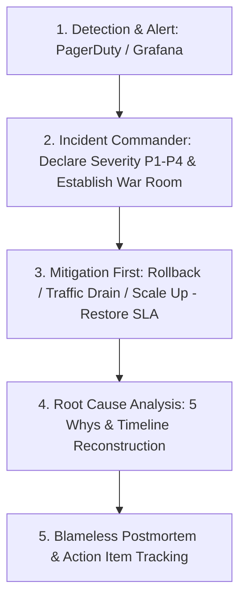

# Production Incident Triage & Blameless Postmortem Master

This skill provides an SRE-grade operational protocol to triage live production incidents, restore service availability, isolate root causes using the 5 Whys, and conduct blameless postmortems.

---

## 🚨 Incident Response Lifecycle

---

## 🎯 Incident Invariants

1. **Mitigate First, Debug Later**: During a live outage, the primary objective is restoring service (e.g. rollback, restart, failover), not fixing the code in place.
2. **Blameless Culture**: Postmortems assume humans operate with good intent given the tools and context they had. Focus on systemic and structural failure modes.
3. **Action Items with Owners**: Every postmortem MUST produce preventive action items with an assigned owner and due date.

---

## 📋 Prosedur Eksekusi

1. **Root Cause Analysis (5 Whys)**:
   - Baca [references/five-whys-rca.md](./references/five-whys-rca.md).
2. **Template Postmortem**:
   - Format: [resources/postmortem-template.md](./resources/postmortem-template.md).
3. **Triage Checklist**:
   - Jalankan `bash skills/incident-postmortem-runbook/scripts/incident-triage-checklist.sh`.