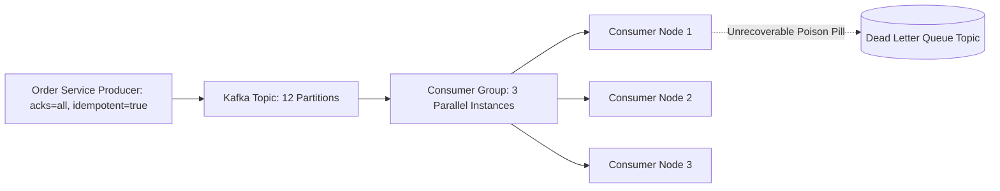

# Apache Kafka & Event-Driven Architecture Master

This skill provides enterprise standards for building reliable, distributed event-driven systems using Apache Kafka with guaranteed delivery, poison pill mitigation, and consumer backpressure handling.

---

## 📨 Kafka Distributed Event Architecture

---

## 🎯 Production Invariants

1. **Idempotent Producers (`enable.idempotence = true`)**: Always configure Kafka producers with `acks=all` and `enable.idempotence=true` to prevent duplicate event writes during network retries.
2. **Deterministic Partition Keys**: Key messages by domain entity ID (e.g. `order_id` or `user_id`) to ensure strict in-order processing per entity across partitions.
3. **Dead Letter Queue (DLQ)**: Never let a corrupted event block an entire consumer partition indefinitely; route unprocessable records to a DLQ topic after 3 failed retries.

---

## 📋 Prosedur Eksekusi

1. **Panduan Partisi & DLQ**:
   - Baca [references/kafka-partitioning-and-dlq.md](./references/kafka-partitioning-and-dlq.md).
2. **Template Kafka Producer**:
   - Rujuk [resources/kafka-producer.ts](./resources/kafka-producer.ts).
3. **Audit Konfigurasi Broker**:
   - Jalankan `bash skills/kafka-event-streaming-architect/scripts/check-kafka-config.sh`.
