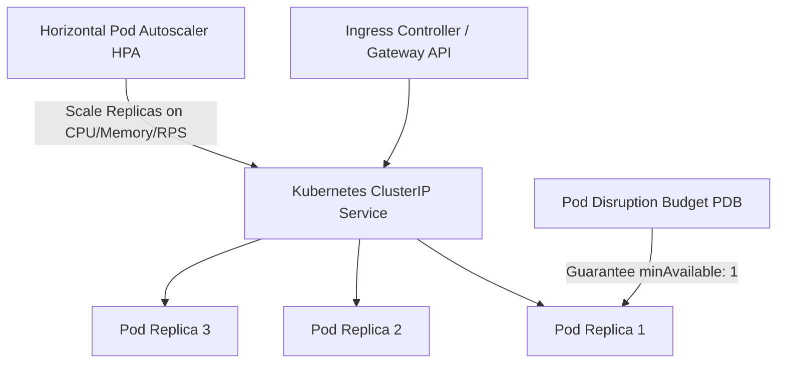

# Kubernetes & Helm Orchestrator Master

This skill provides enterprise-grade standards for creating zero-downtime Kubernetes deployments, Helm charts, resource quotas, and autoscaling policies.

---

## ☸️ Kubernetes Production Deployment Topology

---

## 🎯 Production Invariants

1. **Explicit Resource Requests & Limits**: Every container MUST define `resources.requests` and `resources.limits` (CPU and Memory) to prevent node eviction.
2. **Probes Required**: Every pod must have `livenessProbe` and `readinessProbe` configured.
3. **Pod Disruption Budget (PDB)**: Guarantee high availability during node upgrades with `minAvailable: 1` or `maxUnavailable: 25%`.

---

## 📋 Prosedur Eksekusi

1. **Checklist Produksi K8s**:
   - Baca [references/k8s-production-checklist.md](./references/k8s-production-checklist.md).
2. **Template Deployment & Service**:
   - Manifest: [resources/deployment.yaml](./resources/deployment.yaml).
3. **Validasi Manifest**:
   - Jalankan `bash skills/kubernetes-helm-orchestrator/scripts/lint-k8s.sh`.