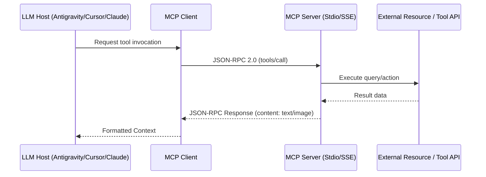

# MCP (Model Context Protocol) Server Developer

This skill provides comprehensive instructions to build, debug, and publish Model Context Protocol (MCP) servers enabling seamless tool and resource sharing with LLMs.

---

## 🔌 The MCP Architecture

---

## 🛠️ Step-by-Step Development Workflow

1. **Scaffold MCP Server**:
   - Use TypeScript (`@modelcontextprotocol/sdk`) or Python (`mcp` package).
   - Reference boilerplate in [resources/server-template.ts](./resources/server-template.ts).

2. **Define Tools with Zod Schemas**:
   - Define strict input schemas and unambiguous tool descriptions.

3. **Verify Stdio / SSE Transport**:
   - Run the validation test: `python3 skills/mcp-server-developer/scripts/test-mcp-stdio.py <command>`.
   - Read protocol specifications in [references/mcp-protocol-specs.md](./references/mcp-protocol-specs.md).