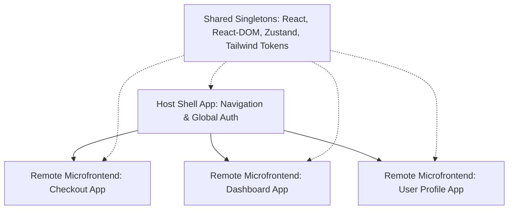

# Microfrontends & Module Federation Master

This skill provides industry standards for scaling frontend engineering organizations using Module Federation, shared runtime singletons, and isolated micro-apps.

---

## 🧩 Module Federation Architecture

---

## 🎯 Production Invariants

1. **Shared Singletons**: Always mark `react` and `react-dom` as `{ singleton: true, requiredVersion: "..." }` to prevent dual-React runtime crashes.
2. **Resilient Fallbacks & Error Boundaries**: Wrap every remote microfrontend in a React Error Boundary with a graceful offline fallback UI.
3. **Decoupled CI/CD**: Each remote repository must be buildable and deployable independently to S3/Cloudflare Pages without redeploying the Host Shell.

---

## 📋 Prosedur Eksekusi

1. **Pola Module Federation**:
   - Baca [references/module-federation-patterns.md](./references/module-federation-patterns.md).
2. **Template Konfigurasi Federation**:
   - Rujuk [resources/rspack-mf.config.js](./resources/rspack-mf.config.js).
3. **Audit Ketergantungan Shared**:
   - Jalankan `bash skills/microfrontends-module-federation/scripts/check-shared-deps.sh`.