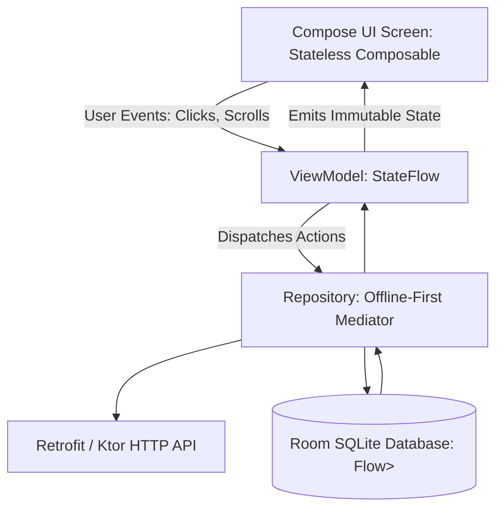

# Native Android & Jetpack Compose Master

This skill provides industry standards for developing scalable, declarative native Android applications with Jetpack Compose, unidirectional data flow (UDF), and structured concurrency.

---

## 🤖 Android Jetpack Compose Architecture (UDF)

---

## 🎯 Production Invariants

1. **Unidirectional Data Flow (UDF)**: Composables must be stateless; state flows down from ViewModel, and user events bubble up via lambdas.
2. **Stable Keys for LazyColumn**: Always specify `key = { it.id }` in `LazyColumn` / `LazyRow` to prevent expensive re-compositions during item reordering.
3. **Structured Coroutine Scopes**: Launch coroutines in `viewModelScope` with `SharingStarted.WhileSubscribed(5000)` to prevent background memory leaks on configuration changes.

---

## 📋 Prosedur Eksekusi

1. **Panduan State & Kotlin Flow**:
   - Baca [references/compose-state-and-coroutines.md](./references/compose-state-and-coroutines.md).
2. **Template Screen Jetpack Compose**:
   - Rujuk [resources/FeedScreen.kt](./resources/FeedScreen.kt).
3. **Audit Kesiapan Android**:
   - Jalankan `bash skills/mobile-android-compose-master/scripts/check-compose-deps.sh`.
