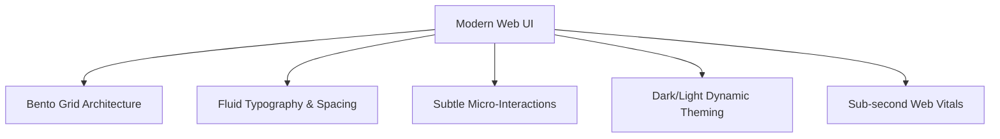

# Modern Web Design Master

This skill provides design blueprints and visual engineering standards for building high-converting, aesthetically stunning, responsive, and performance-optimized modern web applications.

---

## 🎨 Modern Aesthetic Principles

1. **Bento Grid Layouts**: Asymmetrical, modular card-based content grouping with rounded corners (`rounded-2xl` / `rounded-3xl`) and subtle border glows (`border-white/10` with gradient accents).
2. **Micro-Interactions & Spring Physics**: Interactive hover states with gentle scaling (`hover:scale-[1.02] active:scale-[0.98]`), spring transitions, and non-distracting visual cues.
3. **Glassmorphism & Depth**: Multi-layered backgrounds with subtle radial gradient mesh and frosted glass (`backdrop-blur-md bg-white/5 border border-white/10`).
4. **Performance by Default**: Zero Layout Shift (CLS < 0.1), sub-2.5s Largest Contentful Paint (LCP), and sub-200ms Interaction to Next Paint (INP).

---

## 📋 Prosedur Eksekusi

1. **Struktur Layout Bento**:
   - Terapkan grid responsif 12-kolom atau bento 4-kolom dari [references/bento-grid-layouts.md](./references/bento-grid-layouts.md).
2. **Template Siap Pakai**:
   - Gunakan boilerplate modern di [resources/modern-landing-template.tsx](./resources/modern-landing-template.tsx).
3. **Audit Core Web Vitals**:
   - Periksa panduan optimasi di [references/web-vitals-performance.md](./references/web-vitals-performance.md) dan jalankan `bash skills/modern-web-design-master/scripts/check-web-vitals.sh`.