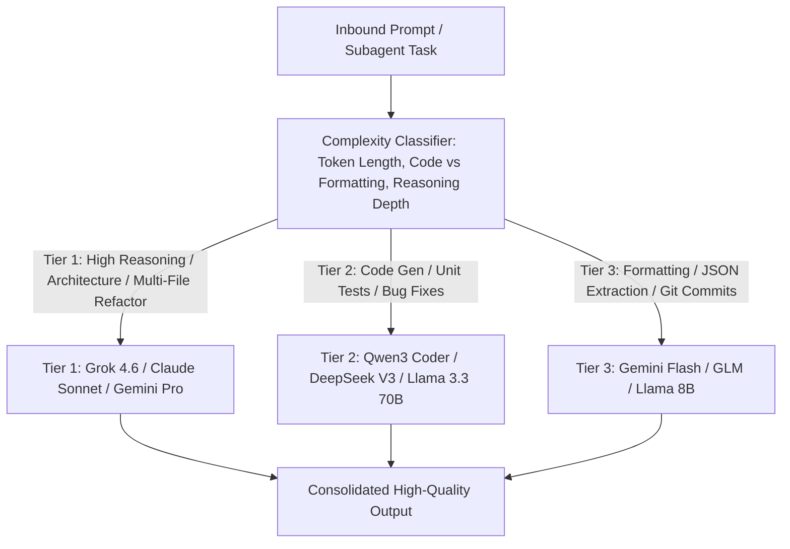

# Multi-Model Hybrid Cost & Intelligence Router

This skill provides an intelligent dispatching mechanism to route prompts to the optimal LLM based on task complexity, context length, and token cost economics.

---

## 🔀 Multi-Model Routing Architecture

---

## 🎯 Production Invariants

1. **Tiered Fallback Matrix**: If a Tier 1 model encounters a rate-limit (HTTP 429), automatically failover to a configured fallback provider within 200ms.
2. **Strict Schema Gate**: Validate structured outputs from all tiers with local schema validators before returning to user.

---

## 📋 Prosedur Eksekusi

1. **Heuristik Routing**:
   - Baca [references/routing-heuristics.md](./references/routing-heuristics.md).
2. **Konfigurasi Router**:
   - Format: [resources/router-config.json](./resources/router-config.json).
3. **Kalkulasi Estimasi Biaya Token**:
   - Jalankan `python3 skills/multi-model-cost-router/scripts/estimate-cost.py <input_tokens> <output_tokens>`.