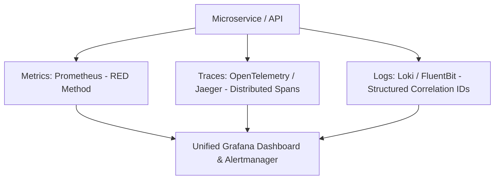

# Observability, Prometheus & Grafana Master

This skill provides complete blueprints for instrumenting distributed microservices using the RED method (Rate, Errors, Duration), OpenTelemetry context propagation, and Prometheus scraping.

---

## 📈 The Three Pillars of Observability

---

## 🎯 Production Invariants

1. **The RED Method on Every Endpoint**:
   - **Rate**: `http_requests_total` counter (req/sec).
   - **Errors**: `http_requests_failed_total` counter (error rate / HTTP 5xx).
   - **Duration**: `http_request_duration_seconds` histogram (p50, p95, p99 latency).
2. **Trace ID Injection**: Inject `trace_id` and `span_id` into all structured log lines to correlate logs with distributed traces.

---

## 📋 Prosedur Eksekusi

1. **RED Method & OpenTelemetry**:
   - Rujuk [references/red-method-and-opentelemetry.md](./references/red-method-and-opentelemetry.md).
2. **Template Konfigurasi Prometheus**:
   - Config: [resources/prometheus.yml](./resources/prometheus.yml).
3. **Audit Endpoint Metrics**:
   - Jalankan `bash skills/observability-prometheus-grafana/scripts/check-metrics-endpoint.sh`.