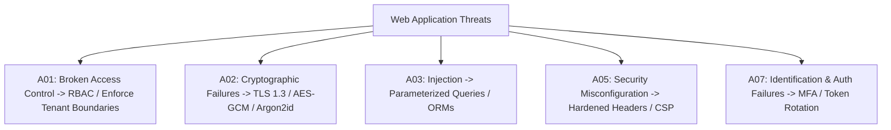

# OWASP Security Auditor & DevSecOps Expert

This skill provides checklists, configuration templates, and automated scanners to protect applications against the OWASP Top 10 and common software supply chain vulnerabilities.

---

## 🛡️ OWASP Top 10 Core Defense Matrix

---

## 🎯 Security Invariants

1. **Parameterized Queries Only**: Never concatenate user input directly into SQL strings.
2. **Strict Content Security Policy (CSP)**: Disallow `unsafe-inline` and `unsafe-eval` in production script-src.
3. **No Hardcoded Secrets**: Secrets must only enter via environment variables or secret vaults (Vault, AWS Secrets Manager).

---

## 📋 Prosedur Eksekusi

1. **Audit OWASP Top 10**:
   - Rujuk panduan mitigasi di [references/owasp-top10-mitigation.md](./references/owasp-top10-mitigation.md).
2. **Terapkan Security Headers**:
   - Gunakan konfigurasi NGINX di [resources/security-headers-nginx.conf](./resources/security-headers-nginx.conf).
3. **Scan Hardcoded Secrets**:
   - Jalankan `python3 skills/owasp-security-auditor/scripts/scan-hardcoded-secrets.py <codebase_dir>`.