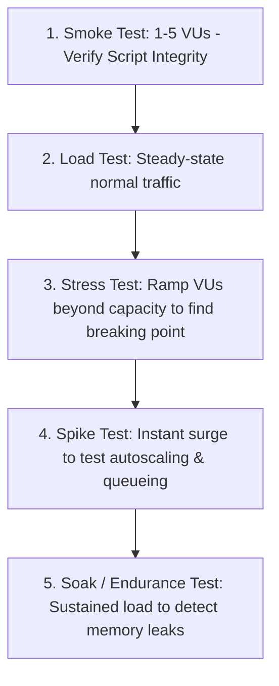

# Performance & Load Testing with k6 Master

This skill provides industry standards for designing realistic load testing scenarios, defining rigorous SLA thresholds, and discovering system breaking points using Grafana k6.

---

## ⚡ Load Testing Stages & Types

---

## 🎯 Production Invariants

1. **Strict SLA Thresholds**: Fail the test automatically if error rate > 1% or p99 latency > 500ms (`thresholds: { http_req_failed: ['rate<0.01'], http_req_duration: ['p(99)<500'] }`).
2. **Realistic User Think Time**: Include dynamic sleep intervals (`sleep(Math.random() * 2 + 1)`) to model human behavior.
3. **No Distributed Testing Blindness**: Monitor server CPU, Memory, and DB Connection Pool utilization concurrently while running tests.

---

## 📋 Prosedur Eksekusi

1. **Metodologi Pengujian Beban**:
   - Baca [references/load-testing-methodology.md](./references/load-testing-methodology.md).
2. **Template Script k6**:
   - Terapkan kode dari [resources/load-test.js](./resources/load-test.js).
3. **Eksekusi Pengujian**:
   - Jalankan `bash skills/performance-load-testing-k6/scripts/run-k6-test.sh`.