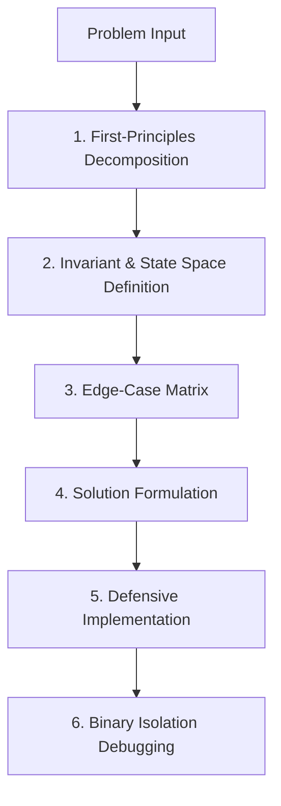

# Programmer Mental Models & First-Principles Problem Solving

This skill provides structured thinking frameworks used by world-class software engineers to decompose complex problems, isolate bugs systematically, maintain state invariants, and evaluate technical trade-offs.

---

## 🧠 Core Mental Models for Engineering

### 1. First-Principles Thinking (Mulai dari Prinsip Dasar)
- Strip away assumptions and analogies.
- Identify the fundamental truths: What are the input constraints, the data transformations, and the required output guarantees?

### 2. State Space Reduction & Invariants
- An **invariant** is a condition that must ALWAYS be true at any given point in execution.
- Shrink the surface area of mutable state (favor immutability, pure functions, state machines).

### 3. Systematic Debugging (Binary Search Bug Isolation)
- Never guess or change random lines of code hoping it works.
- Formulate a hypothesis $\rightarrow$ Reproduce with a minimal failing test $\rightarrow$ Bisect/isolate the failure boundary $\rightarrow$ Fix root cause $\rightarrow$ Verify regression.

---

## 📋 Prosedur Eksekusi (Action Workflow)

1. **Problem Framing**:
   - Tulis ulang problem statement dalam 1 kalimat jelas: "Goal: Transform input X into Y under constraint Z."
2. **Edge-Case Enumeration**:
   - Null / Undefined / Empty collections
   - Boundary values ($0, 1, -1, \text{MAX\_INT}, \text{MIN\_INT}$)
   - Concurrent access & Race conditions
   - Network latency, timeouts, and partial failures
3. **Penerapan Framework**:
   - Baca [references/problem-solving-frameworks.md](./references/problem-solving-frameworks.md) untuk memilih framework (Divide & Conquer, State Machine, Backpressure, Idempotency).
   - Gunakan [references/debugging-heuristics.md](./references/debugging-heuristics.md) saat troubleshooting.

---

## 💡 Quick Reference Checklist
- [ ] Apakah ada mutable global state yang bisa dieliminasi?
- [ ] Apakah fungsi idempotent jika dijalankan ulang?
- [ ] Apakah semua error paths mengembalikan feedback terstruktur (bukan panic/silent fail)?