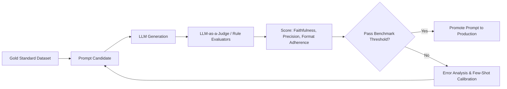

# Prompt Engineering & LLM Evals Master

This skill provides an automated evaluation and prompt engineering framework to eliminate hallucinations, enforce rigid JSON/Pydantic schemas, and run LLM-as-a-Judge benchmark suites.

---

## 🔬 The Continuous LLM Evaluation Loop

---

## 🎯 Production Invariants

1. **Structured Output Enforcement**: Never rely on raw string parsing. Use constrained decoding (JSON Mode, OpenAI Structured Outputs, or Zod/Pydantic schemas).
2. **Deterministic Calibration**: Always benchmark prompt changes against a fixed gold-standard test set of at least 20-50 diverse inputs including adversarial edge cases.
3. **No Fluff Injections**: Prompts must contain precise behavioral constraints, explicit negative examples, and boundary conditions.

---

## 📋 Prosedur Eksekusi

1. **Metodologi LLM-as-a-Judge**:
   - Baca [references/llm-eval-benchmarks.md](./references/llm-eval-benchmarks.md).
2. **Dataset Evaluasi**:
   - Rujuk format [resources/eval-dataset.json](./resources/eval-dataset.json).
3. **Jalankan Benchmark Evaluasi**:
   - Jalankan `python3 skills/prompt-engineering-evals/scripts/run-evals.py`.