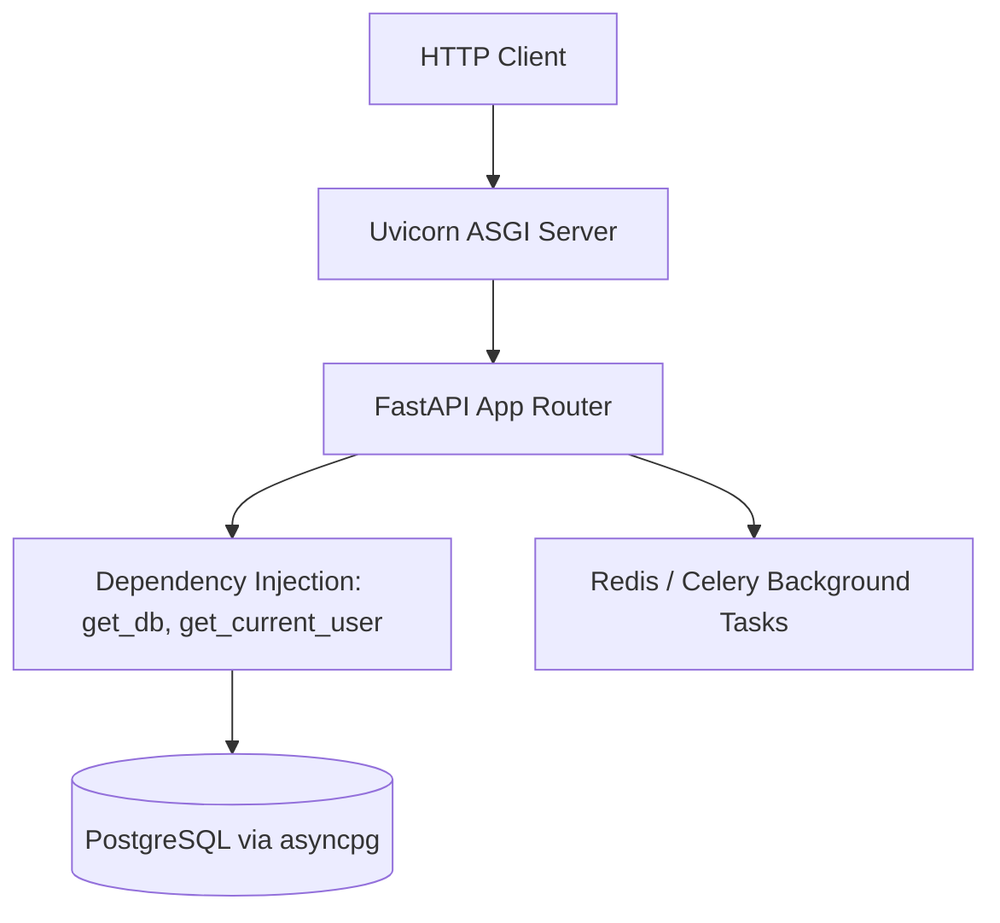

# Python FastAPI Backend Master

This skill provides architectural standards for building high-concurrency async Python services using FastAPI, Pydantic v2 schemas, and SQLAlchemy 2.0 async engine.

---

## ⚡ Async Python Architecture

---

## 🎯 Production Invariants

1. **Non-Blocking Async**: Never run blocking CPU-heavy operations or synchronous file/network I/O inside `async def` route handlers. Use `run_in_threadpool` or background Celery workers.
2. **Pydantic v2 Validation**: Use Pydantic models for strict request body and response serialization.
3. **Session Lifecycle Management**: Always manage database sessions via async context managers (`async with AsyncSessionLocal() as session:`) to prevent connection leaks.

---

## 📋 Prosedur Eksekusi

1. **Pola Async SQLAlchemy 2.0**:
   - Baca [references/fastapi-async-sqlalchemy.md](./references/fastapi-async-sqlalchemy.md).
2. **Boilerplate Production**:
   - Terapkan kode dari [resources/main.py](./resources/main.py).
3. **Linting & Type-Checking**:
   - Jalankan `bash skills/python-fastapi-backend/scripts/lint-python.sh`.