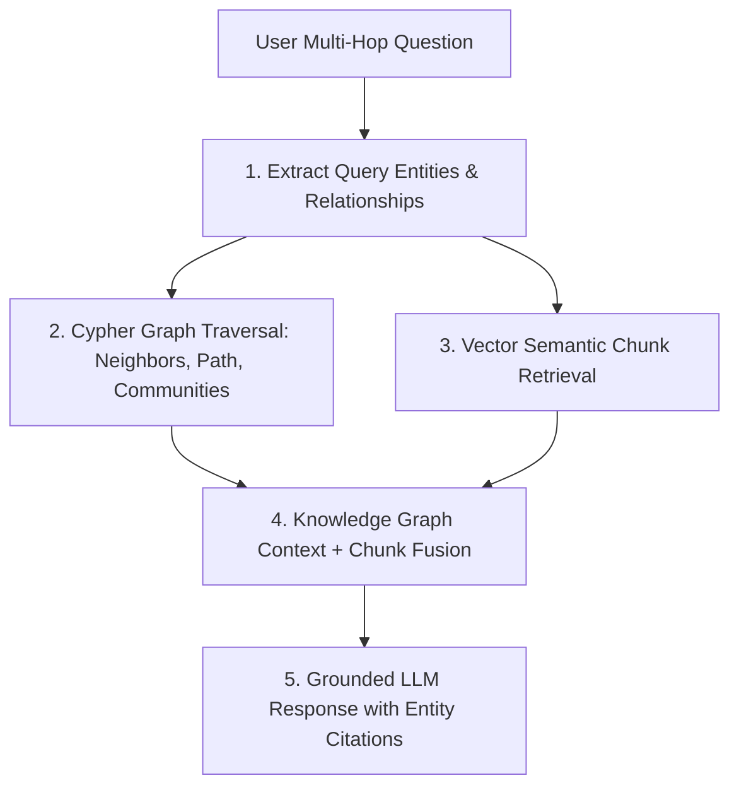

# GraphRAG & Neo4j Knowledge Graph Master

This skill provides industry standards for combining structured Knowledge Graphs with semantic Vector Search to achieve multi-hop, highly accurate Retrieval-Augmented Generation (GraphRAG).

---

## 🕸️ GraphRAG Hybrid Retrieval Pipeline

---

## 🎯 Production Invariants

1. **Entity Disambiguation**: Run fuzzy and semantic similarity resolution before creating graph nodes to avoid duplicate entities (e.g. "Apple Inc" vs "Apple").
2. **Directed & Typed Relationships**: Always declare explicit relationship types with metadata properties (`[:AUTHORED_BY { since: 2024 }]`).
3. **Graph Traversal Depth Limit**: Limit multi-hop traversals to max 2-3 hops to avoid exponential query time explosions.

---

## 📋 Prosedur Eksekusi

1. **Pola Ekstraksi Entitas & Relasi**:
   - Baca [references/graphrag-entity-extraction.md](./references/graphrag-entity-extraction.md).
2. **Template Cypher Queries**:
   - Format: [resources/cypher-queries.cql](./resources/cypher-queries.cql).
3. **Validasi Query Cypher**:
   - Jalankan `bash skills/rag-graph-knowledge-neo4j/scripts/check-cypher-syntax.sh`.
