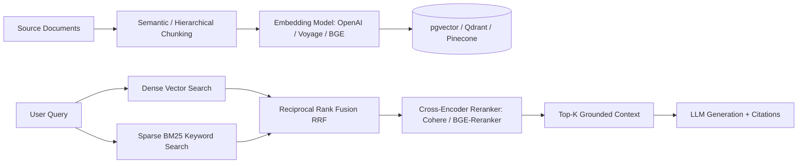

# RAG & LLM Pipeline Integrator

This skill provides industry-standard blueprints for building high-precision Retrieval-Augmented Generation (RAG) systems with minimal hallucination.

---

## 🔍 The Advanced RAG Pipeline

---

## 🎯 Production Invariants

1. **Hybrid Search is Mandatory**: Vector similarity alone fails on exact SKU IDs, error codes, and entity names. Always combine BM25 and Dense Embeddings with Reciprocal Rank Fusion (RRF).
2. **Re-ranking**: Always apply a cross-encoder re-ranker on the top-50 candidates before passing the top-5 to the LLM context window.
3. **Contextual Retrieval**: Prepend document title and section hierarchy metadata to every chunk before embedding.

---

## 📋 Prosedur Eksekusi

1. **Strategi Chunking**:
   - Baca [references/chunking-and-evals.md](./references/chunking-and-evals.md) untuk memilih strategi chunking (sliding window vs recursive markdown vs semantic).
2. **Implementasi Hybrid Pipeline**:
   - Gunakan referensi di [resources/hybrid-search-pipeline.py](./resources/hybrid-search-pipeline.py).
3. **Evaluasi & Benchmarking**:
   - Jalankan benchmark recall/precision: `python3 skills/rag-llm-integrator/scripts/eval-retrieval.py`.