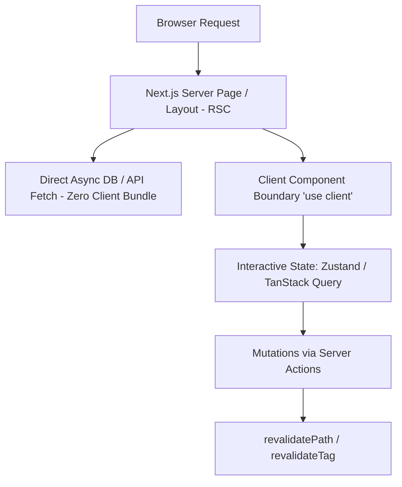

# React & Next.js Master

This skill provides architectural patterns for production Next.js App Router applications, maximizing performance with React Server Components (RSC), seamless caching, and clean client/server boundaries.

---

## ⚡ React Server Components & App Router Model

---

## 🎯 Production Rules for Next.js

1. **Server-First by Default**: Every component is an RSC unless it needs event listeners (`onClick`, `onChange`), browser APIs (`window`, `localStorage`), or React hooks (`useState`, `useEffect`).
2. **Push Client Boundaries Down**: Never mark an entire page as `'use client'`. Extract only the minimal interactive leaf component.
3. **No Waterfalls**: Parallelize data fetching using `Promise.all` or dynamic suspense streaming `<Suspense fallback={<Skeleton />}>`.

---

## 📋 Prosedur Eksekusi

1. **RSC & State Architecture**:
   - Baca panduan mendalam di [references/rsc-and-state.md](./references/rsc-and-state.md).
2. **Template App Router**:
   - Gunakan referensi di [resources/next-app-router-pattern.tsx](./resources/next-app-router-pattern.tsx).
3. **Audit Bundle & Render Tree**:
   - Jalankan `bash skills/react-nextjs-master/scripts/check-react-bundle.sh`.