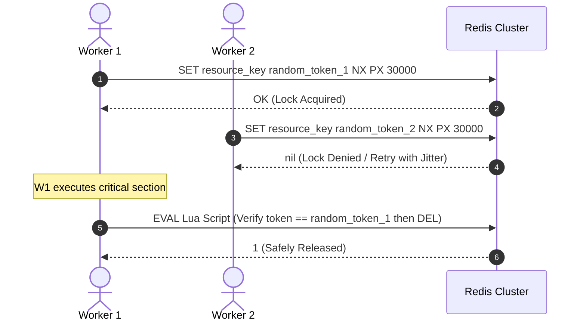

# Redis Distributed Locking & Advanced Caching Master

This skill provides enterprise blueprints for implementing distributed locks with safe release semantics, high-throughput rate limiters, and probabilistic data structures using Redis.

---

## 🔒 Distributed Lock Architecture (Redlock & Safe Release)

---

## 🎯 Production Invariants

1. **Lua Script for Safe Release**: Never release a lock with a bare `DEL key`. A slow process could delete a lock acquired by another worker. Always verify ownership token via Lua script.
2. **Auto-Extending Heartbeat**: For long-running background tasks, spawn a watchdog thread that renews the TTL while the job is alive.
3. **Sliding Window Rate Limiter**: Use Redis Sorted Sets (`ZADD`, `ZREMRANGEBYSCORE`, `ZCARD`) for millisecond-accurate rate limiting.

---

## 📋 Prosedur Eksekusi

1. **Algoritma Redlock & Rate Limiting**:
   - Baca [references/redlock-algorithm.md](./references/redlock-algorithm.md).
2. **Template Distributed Lock**:
   - Rujuk [resources/distributed-lock.ts](./resources/distributed-lock.ts).
3. **Audit Memori & Keyspace**:
   - Jalankan `bash skills/redis-distributed-locking-caching/scripts/check-redis-memory.sh`.