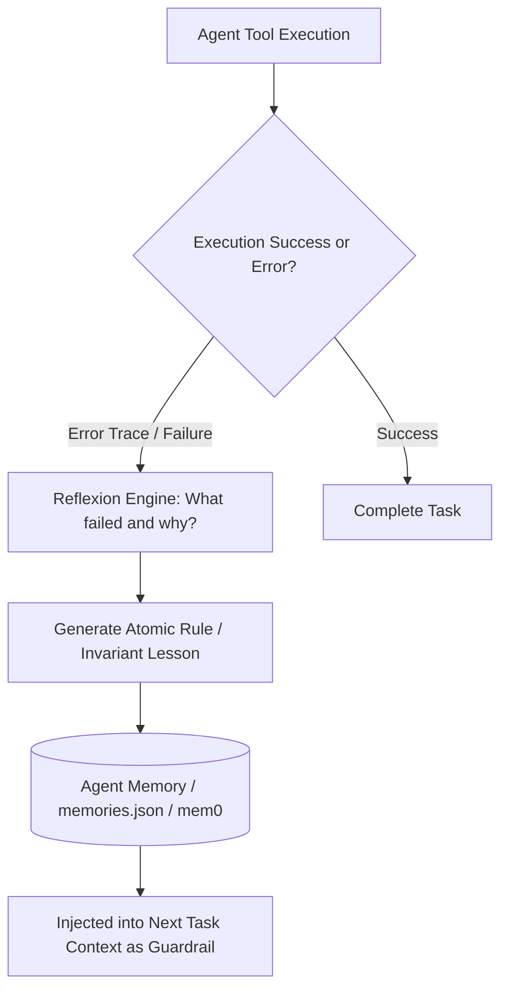

# Self-Evolving Agent Memory & Reflexion Loop Master

This skill provides an autonomous feedback mechanism enabling agents to learn from runtime errors, evaluate past actions, and persist structured lessons in long-term memory.

---

## 🧠 The Reflexion & Self-Correction Architecture

---

## 🎯 Production Invariants

1. **Atomic Lessons**: Store memory reflections as concise, single-sentence actionable invariants (e.g., *"When installing Next.js 15, always specify @tailwindcss/postcss plugin explicitly in postcss.config.mjs"*).
2. **De-duplicate Memories**: Run semantic cosine similarity check before inserting new memory items to prevent memory bloat.

---

## 📋 Prosedur Eksekusi

1. **Pola Reflexion Loop**:
   - Baca [references/reflexion-learning-loop.md](./references/reflexion-learning-loop.md).
2. **Skema Memori**:
   - Format: [resources/memory-schema.json](./resources/memory-schema.json).
3. **Catat Refleksi Otonom**:
   - Jalankan `python3 skills/self-evolving-agent-memory/scripts/log-reflection.py "<task_name>" "<error_summary>" "<lesson_learned>"`.