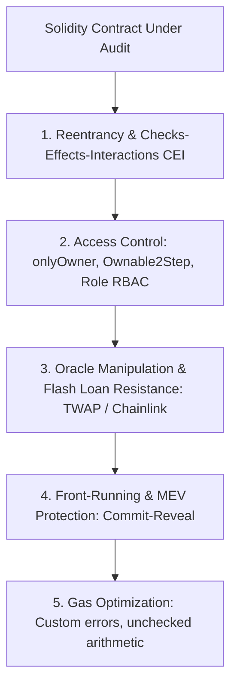

# Web3 & Solidity Smart Contract Security Master

This skill provides an audit framework for verifying decentralized smart contracts against critical EVM vulnerabilities, economic attack vectors, and gas inefficiencies.

---

## 🛡️ Smart Contract Security Vulnerability Hierarchy

---

## 🎯 Production Invariants

1. **Checks-Effects-Interactions (CEI)**: Always update internal contract state BEFORE sending ether or calling external contract functions.
2. **Custom Errors over Strings**: Use `error Unauthorized();` instead of `require(msg.sender == owner, "Unauthorized");` to save deployment and execution gas.
3. **Decentralized Oracles**: Never rely on instantaneous Uniswap spot reserves for pricing in collateralized lending pools.

---

## 📋 Prosedur Eksekusi

1. **Rubrik Kerentanan EVM**:
   - Baca [references/evm-vulnerabilities.md](./references/evm-vulnerabilities.md).
2. **Template Reentrancy Guard**:
   - Rujuk [resources/ReentrancyGuard.sol](./resources/ReentrancyGuard.sol).
3. **Audit Static Analysis**:
   - Jalankan `bash skills/smart-contract-web3-security/scripts/check-solidity-security.sh`.