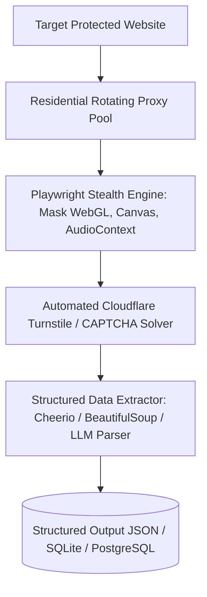

# Stealth Scraper & Crawler Engine Master

This skill provides industry standards for scraping dynamic, JavaScript-heavy single-page applications while bypassing anti-bot challenges and maintaining high proxy throughput.

---

## 🕷️ Stealth Web Crawler Architecture

---

## 🎯 Production Invariants

1. **Fingerprint Anonymization**: Never use standard Puppeteer/Playwright defaults without stripping `navigator.webdriver` and overriding `chrome.runtime`.
2. **Exponential Backoff on 429/403**: If a target endpoint returns HTTP 429 or 403, instantly rotate proxy IP and apply jittered delay.
3. **Structured Pydantic Extraction**: Parse extracted HTML directly into validated JSON schemas.

---

## 📋 Prosedur Eksekusi

1. **Cheatsheet Bypass & Fingerprinting**:
   - Baca [references/stealth-scraping-cheatsheet.md](./references/stealth-scraping-cheatsheet.md).
2. **Template Crawler**:
   - Rujuk [resources/stealth-crawler.py](./resources/stealth-crawler.py).
3. **Uji Koneksi Proxy**:
   - Jalankan `python3 skills/stealth-scraper-crawler-engine/scripts/test-proxy-connection.py`.