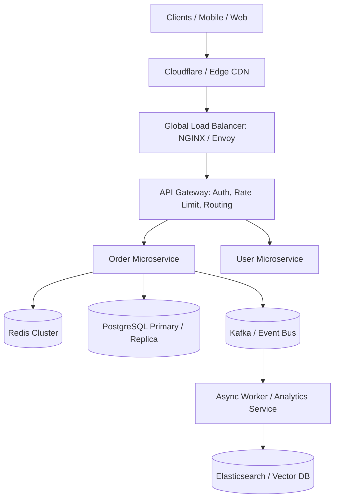

# System Design & High Scalability Architect

This skill provides architectural frameworks to design distributed systems capable of handling high throughput, low latency, and zero single points of failure (SPOF).

---

## 🏛️ Scalable Distributed Architecture

---

## 🎯 Architectural Invariants

1. **Decouple Synchronous Dependencies**: Never make synchronous RPC calls across >2 microservices in the critical path. Use event-driven choreography.
2. **Caching Strategy**: Implement Cache-Aside with jittered TTLs to prevent cache stampedes.
3. **Resilience**: Implement Circuit Breakers, Bulkheads, and Exponential Backoff with Jitter for all downstream dependencies.

---

## 📋 Prosedur Eksekusi

1. **Pola Arsitektur Terdistribusi**:
   - Rujuk [references/distributed-systems-patterns.md](./references/distributed-systems-patterns.md).
2. **Strategi Caching & Redis**:
   - Rujuk [references/caching-strategies.md](./references/caching-strategies.md).
3. **Kalkulasi Kapasitas & Bottleneck**:
   - Jalankan `python3 skills/system-design-architect/scripts/calc-system-capacity.py` untuk menghitung kebutuhan throughput QPS, IOPS, dan storage.