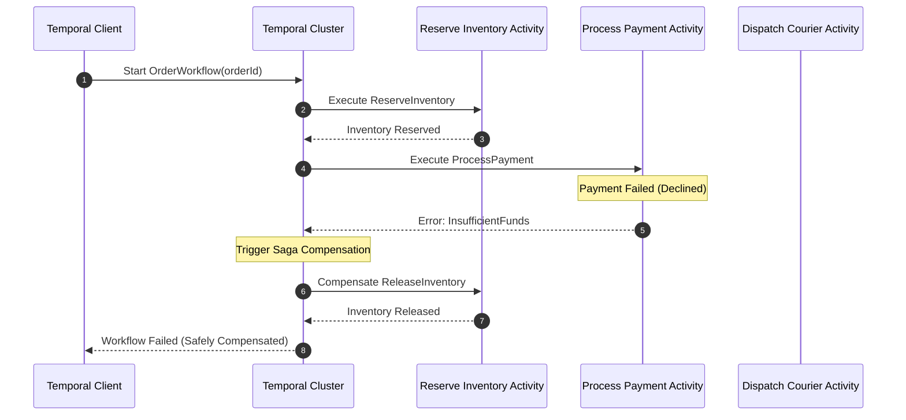

# Temporal & Durable Workflow Orchestration Master

This skill provides enterprise standards for architecting fault-tolerant, durable distributed workflows that automatically resume execution after server crashes or network outages.

---

## ⏳ Durable Workflow & Saga Pattern Architecture

---

## 🎯 Production Invariants

1. **Strict Determinism Law**: Workflows must be 100% deterministic. Never use `Math.random()`, `Date.now()`, or direct non-deterministic network I/O inside workflow functions; run all side effects inside Activities.
2. **Saga Compensations**: For every state-mutating activity, register a corresponding rollback compensation function to handle unexpected failures gracefully.
3. **Durable Sleep**: Use `workflow.sleep()` instead of system `setTimeout` so timers survive infrastructure restarts across months.

---

## 📋 Prosedur Eksekusi

1. **Prinsip Saga & Eksekusi Tahan Banting**:
   - Baca [references/saga-and-durable-execution.md](./references/saga-and-durable-execution.md).
2. **Template Workflow**:
   - Rujuk [resources/order-workflow.ts](./resources/order-workflow.ts).
3. **Audit Determinisme**:
   - Jalankan `bash skills/temporal-workflow-orchestrator/scripts/check-workflow-determinism.sh`.
