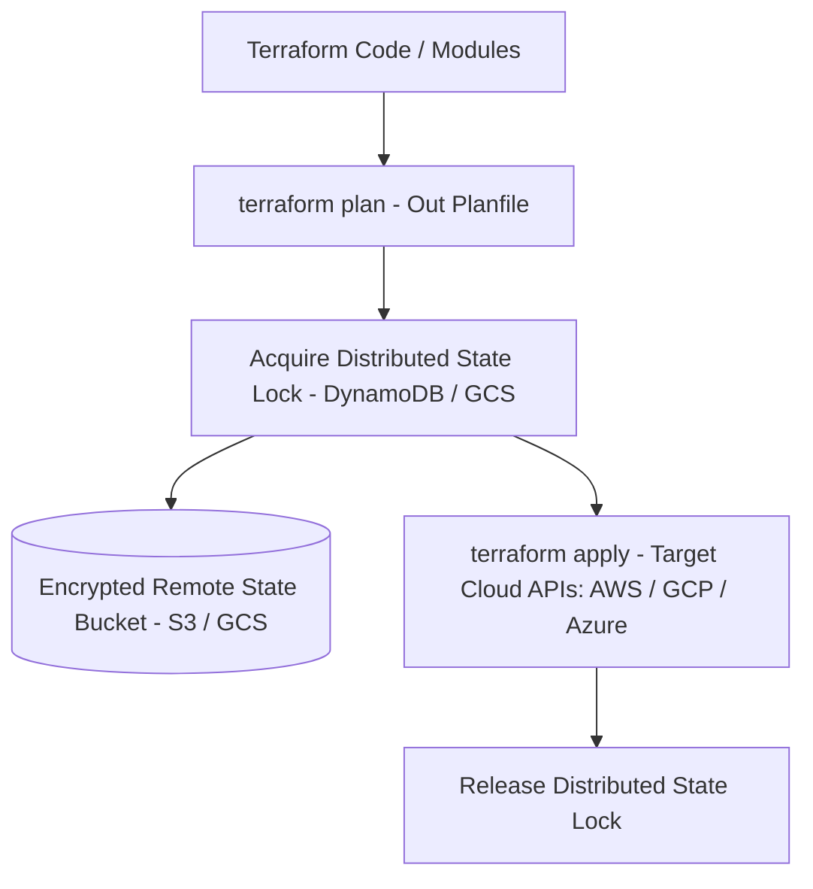

# Terraform & Cloud IaC Master

This skill provides industry standards for creating modular, predictable, and drift-resistant cloud infrastructure using Terraform and OpenTofu.

---

## ☁️ Infrastructure as Code Architecture

---

## 🎯 Production Invariants

1. **Never Store State Locally**: Production Terraform state must always reside in encrypted remote backend storage with state locking enabled.
2. **Deterministic Version Pinning**: Always pin `required_version` and provider versions (`~> 5.0`).
3. **No Hardcoded Secrets**: Use variables, KMS, or dynamic secrets from Vault/AWS Secrets Manager.

---

## 📋 Prosedur Eksekusi

1. **Pola State Locking & Struktur Modul**:
   - Baca [references/terraform-state-locking.md](./references/terraform-state-locking.md).
2. **Template Modul Terraform**:
   - Terapkan konfigurasi dari [resources/main.tf](./resources/main.tf).
3. **Audit Format & Validasi**:
   - Jalankan `bash skills/terraform-cloud-iac/scripts/check-terraform-fmt.sh`.