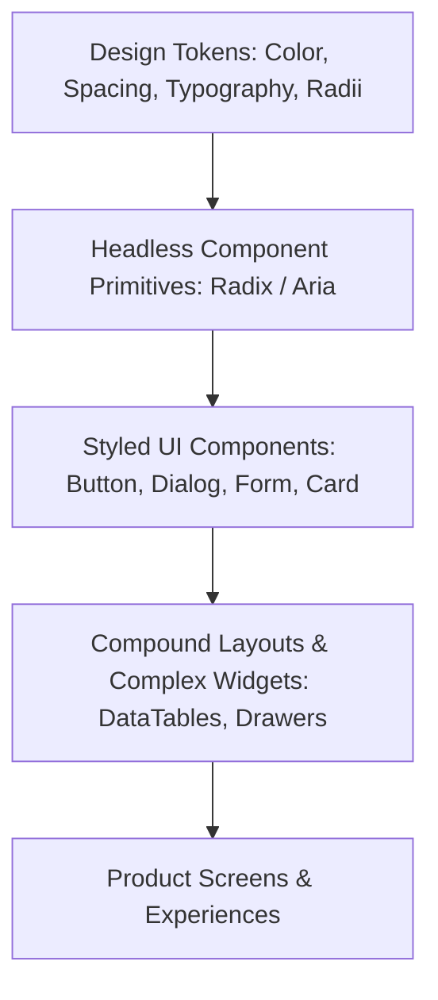

# UI/UX & Design System Expert

This skill provides comprehensive standards for building component libraries, ensuring accessibility (WCAG 2.2 AA), structured design token hierarchies, and resilient UX states (Empty, Loading, Error, Success).

---

## 📐 The Design System Hierarchy

---

## ♿ Accessibility (a11y) Invariants

1. **Keyboard Navigation**: All interactive elements MUST be reachable and actionable via `Tab`, `Enter`, `Space`, and `Escape` (for dialogs/drawers).
2. **Focus Trap & Restoration**: Modals and dropdowns must trap focus when open and restore focus to the triggering element upon closure.
3. **Contrast Ratios**: Normal text must achieve at least **4.5:1** contrast ratio against its background (WCAG AA).
4. **Accessible Labeling**: Every icon button without visible text MUST have `aria-label="Descriptive Action"`.

---

## 📋 Prosedur Eksekusi

1. **Definisi Token Desain**:
   - Terapkan skema warna semantic (`bg-surface`, `text-foreground`, `border-muted`) dari [references/design-tokens-tailwind.md](./references/design-tokens-tailwind.md).
2. **Komponen Headless & Accessible**:
   - Gunakan referensi [resources/accessible-dialog.tsx](./resources/accessible-dialog.tsx) untuk dialog dan modal anti-leak.
3. **Audit Otomatis Kepatuhan a11y**:
   - Jalankan scanner: `python3 skills/ui-ux-design-system-expert/scripts/audit-a11y.py <path_to_components>`.
   - Rujuk checklist [references/wcag-accessibility.md](./references/wcag-accessibility.md).