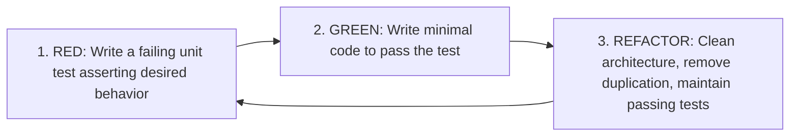

# TDD, Unit & Integration Testing Master

This skill provides comprehensive standards for practicing Test-Driven Development (TDD), utilizing test doubles effectively, and isolating integration tests with in-memory containers.

---

## 🧪 The Red-Green-Refactor TDD Cycle

---

## 🎯 Testing Invariants

1. **Test Behavior, Not Implementation Details**: Never mock private methods. Assert outputs given specific inputs.
2. **Fast Unit Tests**: Unit tests must execute in memory in milliseconds without hitting real network sockets or disk I/O.
3. **Integration Tests with Testcontainers**: For testing database queries or Redis interactions, use real Docker containers managed by Testcontainers.

---

## 📋 Prosedur Eksekusi

1. **Pola TDD & Test Doubles (Mocks vs Stubs vs Fakes)**:
   - Baca [references/tdd-and-test-doubles.md](./references/tdd-and-test-doubles.md).
2. **Template Vitest / Jest**:
   - Terapkan kode dari [resources/user-service.test.ts](./resources/user-service.test.ts).
3. **Audit Coverage & Mutation**:
   - Jalankan `bash skills/unit-integration-tdd-master/scripts/check-coverage.sh`.